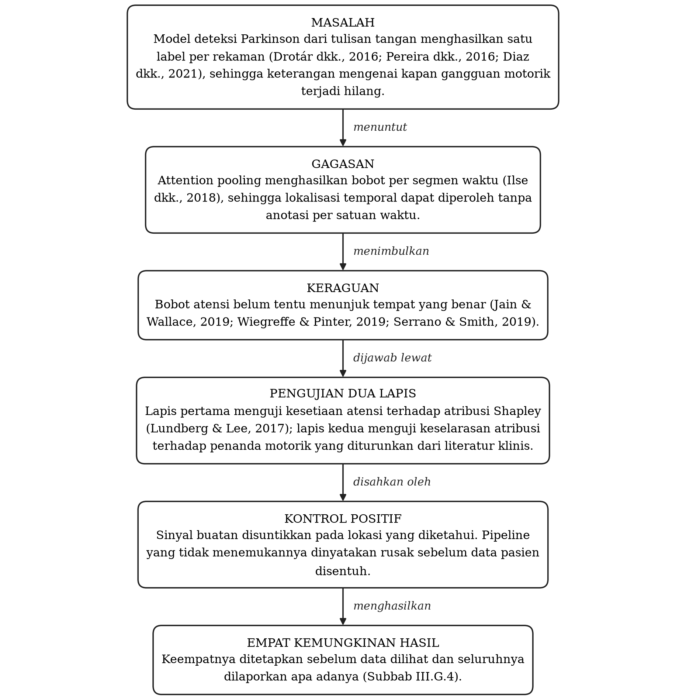
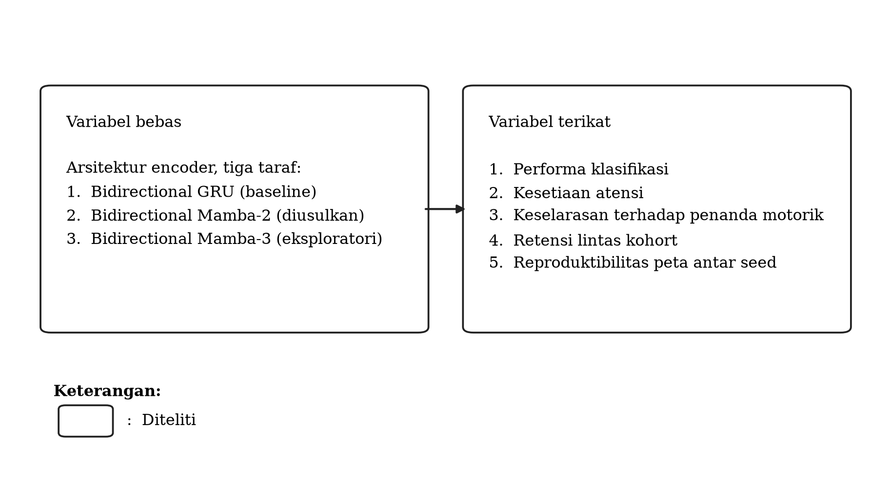

# PROPOSAL SKRIPSI

<br>

## "BENARKAH YANG BENAR SELALU MENUNJUK YANG BENAR?": AUDIT KESETIAAN DAN KESTABILAN ATRIBUSI TEMPORAL BIDIRECTIONAL MAMBA-2 UNTUK LOKALISASI GANGGUAN MOTORIK PARKINSON DALAM TULISAN TANGAN DARING

<br>

**PROPOSAL TUGAS AKHIR**

<br>

Diajukan guna memenuhi sebagian persyaratan menyelesaikan pendidikan Informatika
program Sarjana di Universitas Harapan Bangsa

<br>


<br>

Oleh:

**AGRIBY DIANDRA CHANIAGO**

NIM. 240111017

<br>

**PROGRAM STUDI INFORMATIKA**
**FAKULTAS SAINS DAN TEKNOLOGI**
**UNIVERSITAS HARAPAN BANGSA**
**PURWOKERTO**
**2026**

---

---

> **Catatan mengenai dokumen ini.** Dokumen ini memuat rancangan penelitian dan **tidak memuat satu
> pun angka hasil**. Seluruh ramalan, ambang, dan aturan keputusan yang tertulis di sini ditetapkan
> sebelum data hasil dilihat, sehingga dokumen ini sekaligus berfungsi sebagai **catatan
> pra-registrasi**. Hasilnya dilaporkan terpisah pada naskah seminar hasil.
> Dibangun otomatis dari `NASKAH-SUMBER.md` oleh `scripts/pisah_sempro_semhas.py`
> pada 2026-09-14.


# LEMBAR PERSETUJUAN
## PROPOSAL TUGAS AKHIR

<br>

**"BENARKAH YANG BENAR SELALU MENUNJUK YANG BENAR?": AUDIT KESETIAAN DAN KESTABILAN ATRIBUSI TEMPORAL BIDIRECTIONAL MAMBA-2 UNTUK LOKALISASI GANGGUAN MOTORIK PARKINSON DALAM TULISAN TANGAN DARING**

<br>

Disusun oleh:

**AGRIBY DIANDRA CHANIAGO**

NIM. 240111017

<br>

Purwokerto, ..... ................. 2026

<br>

Menyetujui,

| Pembimbing 1 | Pembimbing 2 |
|---|---|
| <br><br><br> | <br><br><br> |
| **Ir. Purwono, S.Kom., M.Kom.** | **Ir. Rosyid Ridlo Al-Hakim, S.Kom., S.Si., M.T.** |
| NIK. 116705210589 | NIK. 119203240397 |

---

# LEMBAR PENGESAHAN
## PROPOSAL TUGAS AKHIR

<br>

**"BENARKAH YANG BENAR SELALU MENUNJUK YANG BENAR?": AUDIT KESETIAAN DAN KESTABILAN ATRIBUSI TEMPORAL BIDIRECTIONAL MAMBA-2 UNTUK LOKALISASI GANGGUAN MOTORIK PARKINSON DALAM TULISAN TANGAN DARING**

<br>

Disusun oleh:

**AGRIBY DIANDRA CHANIAGO**

NIM. 240111017

<br>

Telah dipertahankan di depan dewan penguji seminar proposal Tugas Akhir pada Program Studi
Informatika Program Sarjana Fakultas Sains dan Teknologi Universitas Harapan Bangsa dan telah
dinyatakan layak untuk dilakukan penelitian

<br>

Pada hari&nbsp;&nbsp;&nbsp;&nbsp;: .................................

Tanggal&nbsp;&nbsp;&nbsp;&nbsp;&nbsp;: .................................

<br>

Dewan penguji:

| | | |
|---|---|---|
| Penguji 1 | ................................. | <br><br> |
| Penguji 2 | Ir. Purwono, S.Kom., M.Kom. | <br><br> |
| Penguji 3 | Ir. Rosyid Ridlo Al-Hakim, S.Kom., S.Si., M.T. | <br><br> |

<br>

Mengesahkan,
Ketua Program Studi Informatika
Fakultas Sains dan Teknologi
Universitas Harapan Bangsa

<br><br><br>

**Dr. Imam Ahmad Ashari, S.Kom., M.Kom.**
NIK. 115911190894

# ABSTRAK

Penyakit Parkinson memengaruhi kontrol motorik halus, dan manifestasinya pada tulisan tangan
mencakup tremor kinetik serta hilangnya kelancaran gerak. Penilaian tanda tersebut saat ini
dilakukan secara semikuantitatif oleh klinisi, dengan keterbatasan berupa subjektivitas dan
ketiadaan resolusi temporal. Tablet digitizer memungkinkan perekaman proses menggambar sebagai
deret waktu multivariat, namun tinjauan terhadap sembilan penelitian terdahulu memperlihatkan
hampir seluruhnya merumuskan tugasnya sebagai klasifikasi tingkat rekaman, sehingga sumbu waktunya
dikonsumsi dan dibuang. Tidak satu pun memakai model ruang-keadaan, tidak satu pun menguji kesahihan
peta temporalnya terhadap acuan yang dihitung independen dari model, dan **tidak satu pun melaporkan
berapa kali pelatihan diulang untuk menghasilkan peta yang ditampilkannya.**

Penelitian ini merumuskan ulang tugas dari klasifikasi menjadi **lokalisasi temporal**: keluarannya
memuat prediksi tingkat subjek sekaligus peta bobot per segmen waktu. Arsitektur yang diusulkan
adalah **Bidirectional Mamba-2** dengan bottleneck *attention pooling*, dibandingkan terhadap
**Bidirectional GRU** sebagai *baseline* yang lazim pada domain ini dan **Bidirectional Mamba-3**
sebagai pembanding eksploratori. Ketiga *encoder* dipertukarkan di dalam kerangka yang sama dengan
seluruh komponen selain *encoder* dikunci identik. Evaluasi dijalankan pada dua basis data yang
**sengaja dipilih berjauhan karakteristik akuisisinya** — tablet digitizer dan smart pen dengan
himpunan sensor yang sama sekali berbeda. Kesahihan peta diuji berlapis lewat tiga acuan yang
perannya dipisah tegas: kontrol positif sinyal sintetis sebagai kebenaran temporal eksplisit,
atribusi Shapley sebagai acuan kesetiaan, dan penanda motorik dari kanal yang sengaja ditahan dari
model sebagai acuan fisiologis. Seluruh ambang, uji, dan aturan keputusan ditetapkan sebelum data
hasil dilihat, tanpa jalan keluar bawaan.

Yang dilaporkan mencakup performa klasifikasi tingkat subjek, ketahanan performa ketika model
dipindahkan antar kohort maupun antar jenis tugas, kesetiaan bobot atensi terhadap atribusi Shapley,
keselarasan peta terhadap penanda motorik independen, biaya pelatihan sebagai fungsi panjang urutan,
serta **reproduktibilitas peta temporal itu sendiri ketika seed pelatihan, kohort, jenis tugas, dan
resolusi patch dipertukarkan** — masing-masing beserta selang kepercayaan dan status konfirmatori
atau eksploratorinya. Kestabilan peta dan performa dinyatakan dalam satuan absolutnya masing-masing,
poin korelasi peringkat dan poin AUC, sehingga kedua besaran itu dapat dibandingkan langsung alih-alih
hanya dilaporkan berdampingan.


**Kata kunci:** lokalisasi temporal, penyakit Parkinson, tulisan tangan daring, atribusi temporal,
reproduktibilitas atribusi, ensemble antar *seed*, kesetiaan atensi, kestabilan atribusi, model
ruang-keadaan, Bidirectional Mamba-2, atribusi Shapley, retensi lintas kohort

---

# ABSTRACT

**"The Model Is Right, but Is It Always Pointing to the Right Moment?": Auditing the Faithfulness and
Stability of Temporal Attribution in Bidirectional Mamba-2 for Parkinsonian Motor Dysfunction
Localization in Online Handwriting**

Parkinson's disease affects fine motor control, and its handwriting manifestations include kinetic
tremor and *loss* of movement fluency. These signs are currently assessed semi-quantitatively by
clinicians, which is subjective and carries no temporal resolution. Digitizing tablets record the
drawing process as a multivariate time series, yet a review of nine prior studies shows that almost
all of them frame the task as recording-level classification, consuming and discarding the time axis.
None uses a *state space* model, none validates its temporal map against a reference computed
independently of the model, and **none reports how many training runs produced the map it displays.**

This study reframes the task from classification to **temporal localization**: the output carries a
subject-level prediction together with a per-segment weight map. The proposed architecture is
**Bidirectional Mamba-2** with bottleneck *attention pooling*, compared against **Bidirectional GRU**
as the *baseline* common in this domain and **Bidirectional Mamba-3** as an exploratory arm. The three
encoders are interchanged inside an identical framework with every component other than the *encoder*
held fixed. Evaluation runs on two databases **deliberately chosen to be far apart in acquisition
characteristics** — a digitizing tablet and a smart pen with an entirely different sensor set. Map
validity is tested in layers through three references whose roles are kept strictly separate: a
synthetic positive control as explicit temporal ground truth, Shapley attribution as a faithfulness
reference, and motor markers computed from channels deliberately withheld from the model as an
independent physiological reference. Every threshold, *test*, and decision rule was fixed before any
result was seen, with no built-in fallback.

What is reported comprises subject-level classification performance, retention of performance when
the model is moved across cohorts and across task families, faithfulness of attention weights to
Shapley attribution, alignment of the temporal map with independent motor markers, training cost as
a function of sequence length, and **the reproducibility of the temporal map itself when the training
seed, cohort, task family, and patch resolution are exchanged** — each with confidence intervals and
its confirmatory or exploratory status. Map stability and performance are stated in their own
absolute units, rank-correlation points and AUC points, so that the two can be compared directly
rather than merely reported side by side.


**Keywords:** temporal localization, Parkinson's disease, online handwriting, temporal attribution,
attribution reproducibility, *seed* ensembling, attention faithfulness, attribution stability, *state*
space model, Bidirectional Mamba-2, Shapley attribution, cross-cohort retention

---


# DAFTAR ISI

```
HALAMAN JUDUL

LEMBAR PERSETUJUAN

LEMBAR PENGESAHAN

ABSTRAK

ABSTRACT

DAFTAR ISI

DAFTAR TABEL

DAFTAR LAMPIRAN

DAFTAR SINGKATAN

BAB I    PENDAHULUAN
         A.  Latar Belakang Masalah
         B.  Perumusan Masalah
         C.  Tujuan Penelitian
         D.  Manfaat Penelitian
         E.  Keaslian Penelitian

BAB II   TINJAUAN PUSTAKA
         A.  Tinjauan Teori
         B.  Kerangka Teori
         C.  Kerangka Konsep
         D.  Hipotesis

BAB III  METODE PENELITIAN
         A.  Jenis dan Rancangan Penelitian
         B.  Lokasi dan Waktu Penelitian
         C.  Variabel Penelitian
         D.  Definisi Operasional Variabel
         E.  Alat dan Bahan
         F.  Prosedur Penelitian
         G.  Analisis Data
         H.  Jadwal Penelitian

DAFTAR PUSTAKA

LAMPIRAN A  Daftar Istilah
LAMPIRAN B  Pertanyaan yang Diantisipasi
LAMPIRAN C  Lubang Rancangan dan Status Penanganannya
LAMPIRAN D  Catatan Penyimpangan Format
```

---

# DAFTAR TABEL

```
Tabel 1.1  Keaslian penelitian ......
Tabel 2.1  Tanda motorik Parkinson menurut sifat dan skala waktunya ......
Tabel 2.2  Tiga peta temporal yang dibandingkan ......
Tabel 2.3  Struktur *state* rekuren ketiga *encoder* ......
Tabel 2.4  Penelitian terdahulu deteksi Parkinson dari tulisan tangan ......
Tabel 2.5  Penelitian terdahulu tentang kesahihan atribusi pada deret waktu ......
Tabel 3.1  Definisi operasional variabel penelitian ......
Tabel 3.2  Spesifikasi perangkat keras dan perangkat lunak ......
Tabel 3.3  Tiga tugas pada UCI 395 dan perannya ......
Tabel 3.4  Butir verifikasi struktur data ......
Tabel 3.5  Enam kanal masukan model ......
Tabel 3.6  Konfigurasi pelatihan yang dibekukan ......
Tabel 3.7  Delapan skenario pengujian ......
Tabel 3.8  Metrik evaluasi menurut aspek yang diukur ......
Tabel 3.9  Tiga definisi retensi lintas kohort ......
Tabel 3.10  Unit penganggitan ulang menurut sumber ketidakpastian ......
Tabel 3.11  Pembanding netral bagi tiap metrik peta ......
Tabel 3.12  Matriks empat kemungkinan hasil ......
Tabel 3.13  Empat cabang hasil retensi yang ditetapkan di muka ......
Tabel 3.14  Ruang pencarian *tuning* hyperparameter ......
Tabel 3.15  Aturan agregasi peta antar *seed* ......
Tabel 3.16  Jadwal penelitian ......
```

---

# DAFTAR LAMPIRAN

```
Lampiran A  Daftar Istilah ......
Lampiran B  Pertanyaan yang Diantisipasi ......
Lampiran C  Lubang Rancangan dan Status Penanganannya ......
Lampiran D  Catatan Penyimpangan Format ......
```

---

# DAFTAR SINGKATAN

```
AUC    Area Under the Curve, luas di bawah kurva ROC
BiGRU  Bidirectional Gated Recurrent Unit
BiSP   Biometric Smart Pen
DST    Dynamic Spiral Test
GRU    Gated Recurrent Unit
MDE    Minimum Detectable Effect, ukuran efek terkecil yang dapat dideteksi
MIL    Multiple Instance Learning
PD     Parkinson's Disease, kelompok penderita Parkinson
ROC    Receiver Operating Characteristic
SHAP   SHapley Additive exPlanations
SSD    Structured State Space Duality
SST    Static Spiral Test
STCP   Stability Test on Certain Point
UCI    University of California, Irvine Machine Learning Repository
XAI    eXplainable Artificial Intelligence
```

---


# BAB I. PENDAHULUAN

## A. Latar Belakang Masalah

Penyakit Parkinson merupakan gangguan neurodegeneratif yang memengaruhi kontrol motorik halus. Manifestasinya pada aktivitas menulis dan menggambar mencakup tremor kinetik, yaitu getaran yang muncul saat tangan sedang bergerak, serta hilangnya kelancaran gerak (Drotár dkk., 2016; Drotár dkk., 2014).

Penilaian tanda tersebut saat ini dilakukan secara semikuantitatif oleh klinisi. Keterbatasannya adalah subjektivitas penilaian, ketergantungan pada ketersediaan dokter spesialis gangguan gerak, dan ketiadaan ukuran yang dapat direplikasi antar pemeriksa.

Perkembangan tablet digitizer memungkinkan perekaman **proses** menggambar, bukan hanya hasil akhirnya (Pereira dkk., 2016a). Sinyal yang direkam mencakup koordinat pena, tekanan pada permukaan, sudut pena, dan waktu, tersampel pada frekuensi puluhan hingga ratusan kali per detik. Objek analisisnya dengan demikian adalah deret waktu multivariat, bukan citra.

Sejumlah penelitian telah menerapkan pembelajaran mesin pada data tersebut, mulai dari pendekatan berbasis fitur kinematik dan tekanan (Drotár dkk., 2016), pendekatan visi komputer (Pereira dkk., 2016b), hingga pendekatan berbasis sekuens menggunakan konvolusi satu dimensi dan Bidirectional GRU (Diaz dkk., 2021). Namun tinjauan menunjukkan hampir seluruhnya merumuskan tugasnya sebagai **klasifikasi tingkat sampel**, yaitu memetakan satu rekaman menjadi satu keputusan biner sakit atau sehat.

Perumusan tersebut membuang informasi yang secara klinis bernilai. Gangguan motorik tidak berlangsung konstan sepanjang proses menggambar. Tremor kinetik muncul sebagai letupan pada momen tertentu, sementara penyimpangan dari bentuk ideal terakumulasi seiring waktu. Model yang hanya menghasilkan satu label tidak dapat menjawab **pada momen mana** kontrol motorik mengalami degradasi, padahal informasi tersebut lebih mendekati cara klinisi menilai.

Penelitian yang menggunakan mekanisme atensi pada domain ini sudah ada. Namun pendekatan terkini seperti PD-MGMA-DSCNN (Rezaee & Fakhrabadi, 2026) bekerja pada representasi citra terpadu dengan penjelasan bersifat **spasial**, yaitu menunjukkan bagian gambar mana yang berpengaruh. Penjelasan bersifat **temporal**, yaitu menunjukkan segmen waktu mana yang berpengaruh, belum ditemukan pada domain tulisan tangan daring. Pendekatan sejenis telah diterapkan pada modalitas suara untuk penyakit yang sama (Gimeno-Gómez dkk., 2024), namun belum pada modalitas tulisan tangan.

Selain itu, terdapat perdebatan yang belum terselesaikan mengenai apakah bobot atensi layak diperlakukan sebagai penjelasan. Jain dan Wallace (Jain & Wallace, 2019) berargumen bahwa bobot atensi tidak memenuhi syarat sebagai penjelasan, sementara Wiegreffe dan Pinter (Wiegreffe & Pinter, 2019) menantang asumsi tersebut dengan menyatakan bahwa klaim demikian bergantung pada definisi penjelasan yang dipakai dan pengujiannya harus memperhitungkan seluruh elemen model. Perdebatan tersebut berlanjut hingga kini (Bibal dkk., 2022). Sebagai konsekuensinya, sejumlah penelitian yang memakai *attention pooling* secara eksplisit menyatakan bobotnya dipakai semata sebagai mekanisme agregasi dan tidak ditafsirkan sebagai ukuran kepentingan kausal (Zhao dkk., 2025).

Perdebatan tersebut sebagian besar berlangsung pada domain pemrosesan bahasa alami, di mana tidak tersedia kebenaran acuan eksternal untuk mengadili peta bobot yang dihasilkan. Domain tulisan tangan medis memiliki dua hal yang tidak dimiliki domain tersebut: penanda motorik yang dapat dihitung secara independen dari model, dan atribusi Shapley (Lundberg & Lee, 2017) sebagai pengukur kontribusi terhadap keluaran yang beraksioma.

Penelitian ini merumuskan ulang tugas dari klasifikasi menjadi lokalisasi temporal, dan menguji kesahihan hasilnya terhadap kedua acuan tersebut.

## B. Perumusan Masalah

1. Bagaimana merancang model pembelajaran mendalam yang tidak hanya mengklasifikasikan rekaman tulisan tangan daring, tetapi juga menghasilkan peta bobot yang menunjukkan segmen waktu mana yang berkontribusi terhadap keputusan model?

2. Bagaimana kesesuaian Bidirectional Mamba-2 sebagai *encoder* untuk lokalisasi temporal, dievaluasi melalui perbandingan performa dan karakteristik peta bobot terhadap Bidirectional GRU sebagai pendekatan yang lazim digunakan pada domain ini, serta terhadap Bidirectional Mamba-3 sebagai pembanding eksploratori, **dan bagaimana biaya pelatihan ketiganya berskala terhadap panjang urutan?**

3. Sejauh mana **metode** yang dikembangkan pada satu basis data dapat direplikasi pada basis data lain yang berbeda perangkat akuisisi, negara, jenis tugas, dan arah komposisi kelasnya, **dan apakah perubahan performa akibat perpindahan kohort itu berbeda menurut arsitektur, serta apakah perbedaan itu khusus perpindahan kohort atau juga muncul ketika hanya jenis tugas yang berganti sementara subjek, perangkat, dan negara dikunci?**

4. Seberapa setia bobot atensi terhadap kontribusi sebenarnya terhadap keluaran model, apabila diukur menggunakan atribusi Shapley pada grid temporal yang sama?

5. Apakah segmen waktu yang berkontribusi terhadap keputusan model selaras dengan penanda motorik yang dihitung secara independen tanpa melibatkan model?

6. Seberapa dapat direproduksi peta atribusi temporal ketika **hanya seed pelatihan** yang berganti sementara data, arsitektur, dan seluruh hyperparameter dikunci, dan sejauh mana ketidakreproduksian itu dapat diredam dengan menggabungkan peta antar *seed*?

## C. Tujuan Penelitian

Tujuan disusun berkorespondensi satu banding satu dengan rumusan masalah.

1. Merancang dan mengimplementasikan arsitektur yang terdiri atas *patch embedding*, *encoder* sekuens, dan bottleneck *attention pooling*, yang menghasilkan prediksi sekaligus peta bobot per segmen waktu.

2. Membandingkan Bidirectional GRU, Bidirectional Mamba-2, dan Bidirectional Mamba-3 sebagai *encoder*, dengan bottleneck dan kepala prediksi dikunci identik sehingga perbedaan performa dapat dievaluasi dalam kondisi seluruh komponen selain *encoder* dipertahankan tetap, **serta mengukur biaya pelatihan ketiganya sebagai fungsi panjang urutan.**

3. Mengevaluasi replikasi metode pada basis data lintas tanpa *tuning* ulang, dengan penanda motorik yang tetap dihitung dari kanal yang ditahan dari model, **serta memisahkan pergeseran akibat perpindahan kohort dari pergeseran akibat pergantian jenis tugas di dalam kohort yang sama.**

4. Mengukur kesetiaan bobot atensi terhadap atribusi Shapley yang dihitung pada grid temporal yang sama.

5. Menguji keselarasan antara atribusi temporal model dan penanda motorik yang dihitung secara independen.

6. Mengukur reproduktibilitas peta atribusi temporal terhadap pergantian *seed* pelatihan, dan menguji apakah penggabungan peta antar *seed* meredam ketidakreproduksian itu.


## D. Manfaat Penelitian

**Manfaat teoretis.** Menyediakan pengukuran empiris atas kesetiaan bobot atensi terhadap kontribusi sebenarnya, pada domain yang memiliki penanda motorik terukur sebagai acuan eksternal. Perdebatan yang dimulai oleh Jain dan Wallace (Jain & Wallace, 2019) serta ditanggapi Wiegreffe dan Pinter (Wiegreffe & Pinter, 2019) sebagian besar berlangsung pada domain tanpa acuan semacam itu, sehingga selama ini bersifat argumentatif.

**Manfaat praktis.** Apabila keselarasan terbukti, penelitian ini menjadi dasar bagi instrumen pengukuran otomatis untuk tanda klinis yang saat ini dinilai secara manual. Apabila tidak terbukti, penelitian ini memberikan peringatan metodologis terhadap praktik menampilkan peta bobot sebagai dasar penjelasan klinis, yang cukup umum pada publikasi domain medis (Rezaee & Fakhrabadi, 2026).

**Manfaat metodologis.** Menyediakan hasil evaluasi di bawah protokol validasi silang berkelompok dan berstrata pada tingkat subjek (Stratified Group K-*Fold*) beserta kontrol positif berbasis sinyal sintetis, yang jarang disertakan pada penelitian domain ini.

---

## E. Keaslian Penelitian

Empat kontribusi berikut merupakan sasaran rancangan, dan status pencapaiannya dilaporkan bersama
hasil.

**1. Menerapkan model ruang-keadaan terpilih dua arah pada domain lokalisasi temporal tulisan tangan
Parkinson.** Dari sembilan penelitian terdahulu yang ditelaah pada Subbab II.A.4, tidak satu pun
memakai keluarga arsitektur ini; domainnya masih berkisar pada fitur agregat, representasi citra,
rekurensi bergerbang, dan atensi pada citra. Dua generasi disertakan, Mamba-2 dan Mamba-3. Mamba
versi pertama sengaja tidak dibawa, sebab Mamba-2 menggantikannya lewat kerangka Structured *State*
Space Duality. Pernyataan ini **dibatasi pada penelitian yang ditelaah** dan bukan klaim ketiadaan
secara mutlak, sebab telaah ini tidak berbentuk tinjauan sistematis.

**2. Merumuskan ulang tugas dari klasifikasi menjadi lokalisasi temporal, dengan tiga acuan yang
berbeda peran.** Keluaran model memuat sumbu waktu, bukan menghabiskannya. Peta yang dihasilkan
diuji berlapis, dan ketiga acuannya **tidak boleh disamakan**:

Tabel 1.1 Keaslian penelitian

| Acuan | Menjawab pertanyaan | Statusnya |
|---|---|---|
| Kontrol positif sinyal sintetis | Dapatkah pipeline memulihkan lokasi yang memang diketahui? | **ground truth temporal eksplisit** yang tersedia dalam rancangan ini |
| Atribusi Shapley | Apakah bobot atensi mencerminkan apa yang menggerakkan keluaran? | acuan **kesetiaan**, bukan kebenaran |
| Penanda dari kanal yang ditahan | Apakah peta berkorespondensi dengan fenomena motorik nyata? | acuan **fisiologis**, independen dari model |

Ditegaskan sejak awal: **atribusi Shapley tidak memvalidasi model.** Ia acuan kesetiaan bagi peta
atensi. Alasan kehadirannya diuraikan pada Subbab II.A.2.d — tanpa Shapley, ketidakselarasan bobot
atensi terhadap penanda memiliki dua penjelasan berlawanan yang tidak dapat dibedakan.

**3. Merancang evaluasi pada dua kohort yang karakteristik akuisisinya berjauhan.** Pemilihan itu
disengaja, dirancang untuk memberikan kondisi evaluasi yang lebih menantang terhadap generalisasi
lintas perangkat dan domain, alih-alih mengasumsikannya.

**4. Menegakkan protokol perbandingan terkendali beserta pemisahan konfirmatori dan eksploratori.**
Ketiga *encoder* dipertukarkan di dalam kerangka yang identik; yang berbeda hanya *encoder*-nya.
Pemisahan status konfirmatori dan eksploratori ditegakkan **pada tingkat kode**, bukan hanya pada
prosa, sehingga penambahan arm eksploratori tidak dapat menggeser vonis konfirmatori.

**5. Mengukur reproduktibilitas peta atribusi terhadap pergantian seed pelatihan, dan menguji
apakah penggabungan antar seed memulihkannya.** Sembilan penelitian terdahulu pada Subbab II.A.4
menampilkan peta temporal tanpa satu pun melaporkan berapa kali pelatihan diulang untuk
menghasilkannya. Penelitian ini mengukur besaran itu secara langsung pada dua kohort dan tiga
arsitektur, lalu memeriksa seberapa banyak pergeseran itu dapat diredam dengan menggabungkan
peta antar *seed*.


Keterangan semacam itu dapat langsung dipakai penelitian lain yang menampilkan peta serupa, terlepas dari
arsitektur yang mereka pakai.

**Catatan mengenai istilah tugas.** Sebutan yang dipakai adalah **lokalisasi temporal tanpa anotasi
temporal eksplisit**, sebab pada data nyata tidak tersedia label kebenaran per satuan waktu. Istilah
*terawasi lemah* dipakai **hanya** bagi jalur bobot atensi, yang memang merupakan formulasi Multiple
Instance Learning (Zhao dkk., 2025); jalur atribusi Shapley bersifat post-hoc murni dan bukan pembelajaran
terawasi lemah.


# BAB II. TINJAUAN PUSTAKA

## A. Tinjauan Teori

### 1. Penyakit Parkinson dan tulisan tangan daring

Bagian ini menetapkan domainnya sebelum variabel apa pun dibicarakan: apa yang rusak pada
gerak menulis penderita Parkinson, dan mengapa tulisan tangan daring merekam kerusakan itu
sebagai deret waktu alih-alih sebagai gambar.

#### a. Penyakit Parkinson dan gangguan grafomotor

Disgrafia Parkinson bermanifestasi melalui beberapa tanda terukur. Dua yang relevan bagi penelitian ini berada pada skala waktu yang berbeda jauh.

Tabel 2.1 Tanda motorik Parkinson menurut sifat dan skala waktunya

| Tanda | Sifat | Skala waktu |
|---|---|---|
| Tremor kinetik | Letupan lokal | Ratusan milidetik |
| Penyimpangan bentuk progresif | Tren lambat | Puluhan detik |

Tremor istirahat pada penyakit Parkinson umumnya berada pada rentang sekitar 4 sampai 6 Hz dan **menghilang saat tangan beraksi** (Szumilas dkk., 2019). Karena menggambar merupakan aksi, yang relevan bagi penelitian ini adalah tremor kinetik.

Rentang pita tremor pada literatur bervariasi. Analisis spiral menggunakan smart ink pen melaporkan puncak spektral kinematik terkonsentrasi pada pita 4 sampai 7 Hz (Toffoli dkk., 2023). Analisis kerapatan spektral daya membagi pita menjadi di bawah 3,50 Hz untuk gerakan volunter, 3,50 sampai 7,50 Hz untuk tremor, dan di atas 7,50 Hz untuk tremor fisiologis normal (Szumilas dkk., 2019).

**Implikasi metodologis.** Pita di bawah 3,50 Hz merepresentasikan gerakan yang disengaja, sehingga daya tremor absolut tidak dapat dipakai langsung dan diperlukan rasio antar pita. Pengecualian terjadi pada tugas yang tidak melibatkan gerakan volunter, sebagaimana dijelaskan pada Subbab III.E.2.a.

#### b. Tulisan tangan daring sebagai deret waktu

Tablet digitizer merekam koordinat, tekanan, sudut, dan waktu per titik data (Isenkul dkk., 2014). Berbeda dengan analisis berbasis citra yang hanya melihat hasil akhir, analisis daring mempertahankan seluruh dinamika proses. Gerakan pena di udara telah diidentifikasi sebagai penanda Parkinson yang bermakna (Drotár dkk., 2014), sehingga tidak diperlakukan sebagai jeda apabila tersedia.

### 2. Variabel terikat: lokalisasi temporal dan kualitasnya

Yang diukur penelitian ini bukan sekadar benar atau salahnya prediksi, melainkan **mutu peta
temporal** yang menyertainya. Empat bagian di bawah menyusun dasar teoretis bagi keempat
besaran itu: perdebatan apakah bobot atensi boleh dibaca sebagai penjelasan, atribusi Shapley
sebagai pembanding beraksioma, cara menilai mutu lokalisasi, dan peran tiga peta temporal yang
dibandingkan satu sama lain.

#### a. Perdebatan bobot atensi sebagai penjelasan

Jain dan Wallace (Jain & Wallace, 2019) menyimpulkan bahwa bobot atensi tidak memenuhi syarat sebagai penjelasan, berdasarkan temuan bahwa bobot atensi berkorelasi lemah dengan ukuran kepentingan berbasis gradien dan bahwa distribusi bobot alternatif dapat menghasilkan prediksi setara. Wiegreffe dan Pinter (Wiegreffe & Pinter, 2019) menanggapi dengan menyatakan bahwa klaim tersebut bergantung pada definisi penjelasan yang digunakan, dan bahwa pengujiannya perlu memperhitungkan seluruh elemen model melalui rancangan eksperimen yang ketat. Telaah mutakhir atas seluruh perdebatan itu (Lyu dkk., 2024) menyimpulkan bahwa kesetiaan penjelasan hanya bermakna bila dinyatakan terhadap definisi dan prosedur uji yang eksplisit — syarat yang ditegakkan penelitian ini lewat pembandingan terhadap atribusi Shapley dan terhadap penanda motorik eksternal. Perdebatan ini belum terselesaikan (Bibal dkk., 2022).

Kedua argumen tersebut dikembangkan pada domain pemrosesan bahasa alami, di mana tidak tersedia kebenaran acuan eksternal untuk mengadili peta bobot. Penelitian ini memasuki perdebatan dari sisi berbeda, yaitu domain yang memiliki penanda motorik terukur.

**Satu bagian perdebatan itu sudah tuntas secara teori, dan perlu dinyatakan agar hasil Rumusan Masalah 4 dibaca dengan benar.** Ethayarajh dan Jurafsky (Ethayarajh & Jurafsky, 2021) membuktikan secara formal bahwa, kecuali pada kasus degenerat, bobot atensi **tidak dapat** merupakan nilai Shapley. Konsekuensinya, besar-kecilnya kesetiaan alpha terhadap phi **bukan** pertanyaan yang terbuka secara teori; yang belum dijawab teori adalah **besarannya pada domain ini**, dan bagaimana kedua peta itu berhubungan dengan penanda motorik yang dihitung independen. Penelitian ini menguji hubungan ketiganya melalui analisis yang telah ditetapkan pada Subbab III.F.6 dan 3.6.6; arah dan besar hubungannya ditentukan oleh analisis itu, bukan diandaikan di sini.

Paper yang sama menunjukkan bahwa aliran atensi, yaitu varian bobot atensi yang diolah melalui algoritma aliran maksimum, memang merupakan nilai Shapley pada tingkat *layer*. Varian itu dirumuskan untuk graf atensi pada Transformer dan tidak berlaku langsung bagi *attention pooling* satu lapis yang dipakai di sini, sehingga tidak diadopsi; ia dicatat sebagai arah lanjutan.

#### b. Atribusi Shapley untuk deret waktu

Nilai Shapley memberikan atribusi beraksioma yang mengkuantifikasi kontribusi setiap masukan terhadap perubahan keluaran model (Lundberg & Lee, 2017). Berbeda dengan bobot atensi yang merupakan produk sampingan proses agregasi, atribusi Shapley mengukur kontribusi terhadap keluaran secara langsung melalui perturbasi.

KernelSHAP memperlakukan masukan sebagai himpunan pemain statis per fitur dan mengabaikan dependensi, sehingga koalisi berbasis perturbasinya tidak mencerminkan struktur sekuensial. Pada sinyal gerak yang mulus, segmen bertetangga berkorelasi kuat sehingga asumsi tersebut dilanggar.

WindowSHAP (Nayebi dkk., 2023) mengatasi hal ini dengan menggabungkan langkah waktu bertetangga menjadi jendela waktu. Pendekatan tersebut menurunkan dependensi antar elemen yang dihitung nilai Shapley-nya, sekaligus menurunkan runtime secara eksponensial seiring bertambahnya panjang jendela.

**Kesesuaian dengan rancangan ini.** Jendela WindowSHAP disamakan dengan grid *patch* model, sehingga atribusi Shapley dan bobot atensi berada pada grid temporal yang identik tanpa memerlukan penyelarasan ulang.

**Keterbatasan yang diakui, dan cara memeriksanya.** Nilai Shapley membagi kredit di antara fitur yang berkorelasi (Aas dkk., 2021). Pada rancangan ini, tremor tersebar di banyak jendela berdekatan, sehingga menghapus satu jendela saja mungkin nyaris tidak mengubah keluaran. Konsekuensinya, atribusi Shapley berpotensi terbagi tipis ke banyak jendela alih-alih terpusat.

Kemungkinan itu diuji langsung, bukan diandaikan tidak terjadi. Tiga fungsi uji dibangun dengan lokasi sinyal identik namun struktur interaksi berbeda: aditif (tiap jendela menyumbang mandiri), maksimum (redundan, satu jendela sudah cukup), dan minimum (komplementer, seluruh jendela harus hadir). Hasil pengujian ketiga struktur itu dilaporkan pada naskah hasil, beserta konsekuensinya bagi penafsiran besaran atribusi.

Konsekuensi rancangannya: karena metrik lokalisasi bersifat invarian terhadap skala, redundansi tidak dengan sendirinya membatalkan analisis keselarasan pada Subbab III.G.2. Yang dilarang adalah menafsirkan besaran phi absolut sebagai ukuran kepentingan, dan larangan itu dipatuhi dengan hanya melaporkan besaran relatif serta metrik berbasis peringkat dan massa. Rincian pengujiannya ada pada `notebooks/05_atribusi_shapley.ipynb`.

#### c. Evaluasi kualitas lokalisasi atribusi

Menilai apakah suatu peta atribusi menunjuk tempat yang benar memerlukan kebenaran acuan, yang jarang tersedia pada data nyata. Praktik yang lazim adalah membangkitkan data sintetis dengan fitur pembeda kelas ditempatkan pada lokasi yang diketahui, lalu mengukur seberapa banyak atribusi jatuh di lokasi itu (Baer, 2026). Rancangan kontrol positif pada Subbab III.F.3 mengikuti pola tersebut. Telaah menyeluruh atas metode penjelasan bagi klasifikasi deret waktu (Theissler dkk., 2022) mencatat bahwa evaluasi lokalisasi pada domain ini masih jarang memakai acuan di luar model itu sendiri.

Literatur evaluasi XAI menyediakan perangkat metrik lokalisasi yang mapan untuk keperluan ini, antara lain Relevance Mass Accuracy dan Relevance Rank Accuracy (Arras dkk., 2022), serta Pointing Game dan AUC lokalisasi sebagaimana dihimpun pada Quantus (Hedström dkk., 2022). Metrik-metrik tersebut mengukur aspek yang berbeda dan dapat berselisih pada peta atribusi yang runcing, sehingga dilaporkan sebagai perangkat, bukan sebagai ukuran tunggal (Subbab III.G.2).

Temuan Ismail dkk. (Ismail dkk., 2020) memberi konteks yang penting bagi penelitian ini: pada data deret waktu, arsitektur jaringan dan metode saliency umumnya **gagal** mengidentifikasi kepentingan fitur sepanjang waktu secara andal, terutama karena bercampurnya domain waktu dan domain fitur. Kegagalan itu terjadi pada tugas dengan kebenaran acuan yang diketahui, sehingga bukan persoalan sulitnya data melainkan persoalan metodenya. Penelitian ini karena itu tidak mengandaikan peta atribusi temporal sahih dengan sendirinya, melainkan menjadikannya objek yang diuji.

#### d. Peran tiga peta temporal

Penelitian ini menghasilkan tiga besaran pada grid temporal yang sama:

Tabel 2.2 Tiga peta temporal yang dibandingkan

| Simbol | Isi | Sumber |
|---|---|---|
| alpha | Bobot yang diberikan kepala agregasi | Internal model |
| phi | Kontribusi terhadap keluaran | Atribusi Shapley, berbasis perturbasi |
| marker | Manifestasi patologi | Dihitung dari sinyal, tanpa model |

Ketiadaan phi menimbulkan ambiguitas yang tidak dapat diuraikan. Apabila alpha tidak selaras dengan marker, terdapat dua penjelasan yang menghasilkan pengamatan identik namun berkesimpulan berlawanan: model tidak menggunakan sinyal klinis, atau model menggunakannya namun alpha gagal merepresentasikannya. Atribusi Shapley memisahkan keduanya.

### 3. Variabel bebas: encoder yang dipertukarkan

Satu-satunya hal yang berbeda antar arm penelitian ini adalah *encoder*-nya; segala hal lain —
prapemrosesan, bottleneck, kepala klasifikasi, protokol validasi — dibuat identik. Tiga bagian
di bawah menguraikan ketiga *encoder* tersebut beserta mekanisme agregasi yang menghasilkan peta
temporal yang kemudian diaudit.

#### a. Bidirectional GRU

Gated Recurrent Unit memproses urutan secara berurutan dengan *gate* yang mengatur pembaruan *hidden state*. Varian bidirectional memproses urutan dari dua arah dan menggabungkan keduanya. Arsitektur ini dipilih sebagai *baseline* karena merupakan pendekatan yang lazim pada domain analisis tulisan tangan daring untuk deteksi Parkinson (Diaz dkk., 2021).

#### b. Attention dan Mamba-2

Mekanisme self-attention diperkenalkan sebagai pengganti rekurensi (Vaswani dkk., 2025), dengan keterbatasan berupa kompleksitas kuadratik terhadap panjang urutan. Mamba memperkenalkan selective *state space* model dengan kompleksitas linear (Gu & Dao, 2023). Mamba-2 menyempurnakannya melalui kerangka Structured *State Space* Duality, yang menunjukkan bahwa *state space* model dan self-attention merupakan dua sisi dari formulasi yang sama (Dao & Gu, 2024). Telaah atas keluarga *state space* model (Patro & Agneeswaran, 2025) menempatkannya sebagai alternatif transformer yang biayanya linear, sementara pengujian empiris pada peramalan deret waktu (Wang dkk., 2025) menunjukkan keunggulan itu tidak berlaku merata di seluruh tugas — sesuai temuan penelitian ini bahwa keunggulan biaya bergantung panjang urutan.

Keunggulan yang relevan bagi penelitian ini:

1. **Pemisahan skala waktu antar head.** Mamba-2 bersifat multi-head dengan parameter peluruhan per head, sehingga secara struktural dapat merepresentasikan fenomena cepat dan lambat secara terpisah. Ini sesuai dengan karakteristik dua tanda klinis pada Subbab II.A.1.a yang skala waktunya terpaut dua sampai tiga orde besaran.

2. **Jalur gradien jarak jauh.** Transisi *state* bersifat skalar kali identitas, sehingga jalur gradien antar langkah tidak melewati nonlinearitas. Deteksi tren lambat menuntut kemampuan membawa informasi melintasi ribuan langkah waktu.

3. **Paralelisasi saat pelatihan**, yang memungkinkan penggunaan resolusi temporal lebih halus dalam anggaran komputasi yang sama.

**Perluasan: BiMamba-3 sebagai arm ketiga.** Mamba-3 (Lahoti dkk., 2026) menambahkan tiga hal atas Mamba-2, dan salah satunya berkaitan langsung dengan masalah penelitian ini: **state bernilai kompleks**. *State* bernilai riil hanya dapat merepresentasikan peluruhan; *state* bernilai kompleks dapat merepresentasikan **rotasi, yaitu osilasi**. Tanda patologi yang hendak dilokalisasi di sini justru berupa osilasi pada pita 3,50 sampai 7,50 Hz.

Ketiga arm karena itu membentuk satu tangga yang variabelnya relevan langsung dengan masalahnya, bukan tiga model yang kebetulan dicoba:

Tabel 2.3 Struktur *state* rekuren ketiga *encoder*

| Arm | Struktur *state* rekuren | Dapat merepresentasikan |
|---|---|---|
| BiGRU | rekurensi bergerbang | tanpa struktur skala waktu eksplisit |
| BiMamba-2 | peluruhan bernilai riil per head | peluruhan, yaitu skala waktu |
| BiMamba-3 | *state* bernilai kompleks | rotasi, yaitu osilasi |

Rumusan Masalah 2 dengan demikian menjadi lebih tajam: apakah kemampuan merepresentasikan osilasi memengaruhi klasifikasi maupun peta temporal. Pertanyaan itu dapat dijawab "tidak", dan jawaban itu tetap merupakan hasil.

**Statusnya eksploratori, dan itu dinyatakan terus terang.** BiMamba-3 disertakan sebagai pembanding eksploratori dan **tidak memengaruhi aturan keputusan konfirmatori**. Penjagaannya dilakukan pada tingkat kode: aturan keputusan Subbab III.G.1 dihitung hanya dari dua arm pra-registrasi, sehingga variansi arm ketiga secara mekanis tidak dapat ikut menentukannya.

Catatan implementasi. Mamba-3 **tidak memakai konvolusi kausal**, sehingga ketergantungan pada `causal_conv1d` hilang. Dipakai varian SISO, sebab varian MIMO menuntut pustaka yang tidak disertakan; konfigurasi arsitektur disesuaikan dengan batasan antarmuka implementasi yang dipakai.

**Prediksi yang dapat diuji.** Keunggulan poin 1 dan 2 hanya relevan pada urutan panjang. Pada resolusi *patch* kasar, keunggulan tersebut diperkirakan tidak muncul. Sweep resolusi *patch* pada Skenario S2 menguji prediksi ini.


**Keterbatasan yang diakui.** *Gate* pembaruan GRU juga bergantung pada masukan, sehingga selektivitas bukan sifat eksklusif Mamba. Rekurensi linear kurang ekspresif dibandingkan rekurensi nonlinear. Transisi skalar kali identitas pada Mamba-2 lebih terbatas dibandingkan transisi diagonal penuh pada Mamba versi pertama (Dao & Gu, 2024). Pada jumlah subjek terbatas, kapasitas lebih besar berpotensi merugikan.

**Konsekuensi terhadap rancangan pembanding.** Karena Mamba-2 secara matematis merupakan bentuk atensi terstruktur (Dao & Gu, 2024), Transformer dan Mamba-2 merupakan keluarga yang berdekatan. Bidirectional GRU, sebagai model rekuren nonlinear bergerbang, memiliki jarak bias induktif yang lebih jauh. Pemasangan BiGRU dan BiMamba-2 dengan demikian memaksimalkan jarak bias induktif antar pembanding.

#### c. Attention pooling

*Attention pooling* mengagregasi representasi sekuens menjadi satu vektor melalui bobot yang dipelajari. Rumusannya identik dengan attention-based multiple instance learning pooling yang diperkenalkan Ilse dkk. (Ilse dkk., 2018). Mekanisme ini **bukan kebaruan penelitian ini**, melainkan komponen mapan yang diadopsi. Kebaruannya terletak pada pengujian kesahihan bobot yang dihasilkannya.

### 4. Keterkaitan antarvariabel pada penelitian terdahulu

Tabel 2.4 Penelitian terdahulu deteksi Parkinson dari tulisan tangan

| No | Peneliti | Metode | Data | Pembeda penelitian ini |
|---|---|---|---|---|
| 1 | Drotár dkk. (Drotár dkk., 2016) | Fitur kinematik dan tekanan, SVM dan AdaBoost | PaHaW | Fitur agregat, tanpa lokalisasi temporal di dalam rekaman |
| 2 | Drotár dkk. (Drotár dkk., 2014) | Analisis gerakan pena di udara | PaHaW | Fitur agregat |
| 3 | Pereira dkk. (Pereira dkk., 2016b) | Visi komputer berbasis Optimum-Path Forest | HandPD | Berbasis citra, sumbu waktu tidak digunakan |
| 4 | Pereira dkk. (Pereira dkk., 2016a) | CNN pada dinamika tulisan tangan | NewHandPD | Sinyal dikonversi menjadi citra berbasis waktu |
| 5 | Diaz dkk. (Diaz dkk., 2021) | Konvolusi 1D dan Bidirectional GRU | PaHaW, NewHandPD | Keluaran label tunggal per rekaman. Menjadi *baseline* penelitian ini |
| 6 | PD-MGMA-DSCNN (Rezaee & Fakhrabadi, 2026) | Multiscale gated multi-head attention, optimasi Bayesian-genetik, penjelasan SHAP | PaHaW, HandPD | Representasi citra dengan penjelasan **spasial**. Penelitian ini memakai deret waktu dengan penjelasan **temporal**, dan mengukur kesetiaan atensi terhadap atribusi Shapley |
| 7 | Gimeno-Gómez dkk. (Gimeno-Gómez dkk., 2024) | Cross-attention, analisis temporal berbutir halus | Tolok ukur suara PD | Modalitas suara. Penelitian ini memindahkan pendekatan tersebut ke modalitas tulisan tangan |
| 8 | MFAM (Zhao dkk., 2025) | Attention-based MIL pooling, motivasi sparsity temporal gejala PD | Sensor wearable | Bobot atensi tidak diuji kesahihannya terhadap acuan eksternal |
| 9 | Shin dkk. (Shin dkk., 2025) | 88 fitur kinematik, SFFS, ensemble voting | PaHaW | Fitur agregat. Melaporkan akurasi sangat tinggi yang penyebut item ujinya perlu diperiksa |
| 10 | Chavez dkk. (Chavez dkk., 2025) | Konversi deret waktu menjadi citra, ResNet50, evaluasi lintas-korpus | PaHaW, NewHandPD, dan basis data Alzheimer | Melaporkan F1 sampai 98 lintas basis data. Sumbu waktunya dikonversi menjadi citra, sehingga **penjelasannya kembali spasial**; lokalisasi temporal maupun kesahihan petanya tidak diuji |
| 11 | Huang dkk. (Huang dkk., 2024) | Klasifikasi spiral gambar tangan dengan jaringan dalam, ditujukan pada diagnosis dini | Spiral gambar tangan | Bekerja pada citra spiral yang sudah jadi, bukan pada deret waktu penulisannya, sehingga sumbu waktu tidak tersedia untuk dilokalisasi |
| 12 | Aldhyani dkk. (Aldhyani dkk., 2024) | Pemodelan dan diagnosis Parkinson dari gambar tangan | Gambar tangan | Sama seperti (Huang dkk., 2024): representasi citra, penjelasan spasial, tanpa uji kesahihan peta |

### Penelitian terdahulu tentang kesahihan atribusi pada deret waktu

Penelitian ini berdiri di persimpangan dua literatur. Yang pertama, deteksi Parkinson dari tulisan
tangan, ditelaah pada tabel di atas. Yang kedua menanyakan sesuatu yang berbeda: **apakah peta
penjelasan yang dihasilkan model deret waktu layak dipercaya.** Literatur kedua ini sedang bergerak
cepat dan, yang lebih penting, **belum sepakat**.

Tabel 2.5 Penelitian terdahulu tentang kesahihan atribusi pada deret waktu

| No | Peneliti | Yang dikerjakan | Data | Hubungannya dengan penelitian ini |
|---|---|---|---|---|
| 13 | Balestra dkk. (Isenkul dkk., 2013) | Konsistensi dan ketegaran penjelasan saliency untuk klasifikasi deret waktu | Tolok ukur deret waktu umum | Menetapkan bahwa kestabilan peta merupakan besaran yang layak diukur, bukan diasumsikan. Tanpa acuan eksternal di luar model |
| 14 | Yadav dan Subbian (Yadav & Subbian, 2024) | Melatih **1.000 varian** LSTM beratensi dengan inisialisasi acak berbeda, lalu mengukur konsistensi skor atensi per sampel | Deret waktu klinis berdimensi tinggi (mortalitas, keparahan) | **Paling dekat dengan Rumusan Masalah 6.** Menyimpulkan atensi tidak konsisten antar *seed* sehingga tidak andal sebagai alat interpretasi. Berhenti pada diagnosis; tidak menguji apakah ketidakkonsistenan itu dapat diredam, dan tidak memiliki acuan fisiologis independen |
| 15 | Fan dkk. (Fan dkk., 2026) | Tolok ukur reproduktibilitas metode interpretasi lintas tugas klinis dan arsitektur | Tugas prediksi klinis, kerangka PyHealth | **Menyimpulkan berlawanan** dengan (Yadav & Subbian, 2024): atensi yang dipakai secara tepat justru efisien dan setia. Juga menyatakan KernelSHAP dan LIME tidak layak komputasi pada deret waktu klinis |
| 16 | Firmawan dan Darnoto (Firmawan & Darnoto, 2026) | Menguji apakah penjelasan tetap setia dan stabil ketika domain bergeser, memakai korelasi peringkat Spearman lintas domain atas SHAP dan atensi | Dua korpus teks yang berbeda ragam bahasanya | **Pertanyaannya sama persis dengan penelitian ini, pada domain yang berbeda.** Menguatkan bahwa kesetiaan lintas domain layak diuji; bedanya, teks tidak memiliki acuan fisiologis independen sebagaimana penanda motorik di sini |

**Dua kesimpulan yang berlawanan, pada pertanyaan yang sama.** Yadav dan Subbian (Yadav & Subbian, 2024) menyimpulkan
atensi tidak andal; Fan dkk. (Fan dkk., 2026) menyimpulkan atensi setia bila dipakai dengan benar. Keduanya
terbit dalam rentang kurang dari setahun, keduanya pada deret waktu klinis. Perdebatan yang dimulai
Jain dan Wallace (Jain & Wallace, 2019) serta ditanggapi Wiegreffe dan Pinter (Wiegreffe & Pinter, 2019) pada teks karena itu **belum selesai,
dan kini berpindah ke deret waktu**.

Yang menempatkan penelitian ini di dalam perdebatan tersebut, dan bukan di sampingnya: **tidak satu
pun dari ketiganya memiliki acuan yang dihitung independen dari model.** Konsistensi diukur terhadap
peta lain, dan kesetiaan diukur terhadap keluaran model. Penelitian ini menambahkan sumbu ketiga —
penanda motorik yang dihitung dari kanal yang sengaja ditahan dari model — sehingga pertanyaan
"peta ini stabil" dan "peta ini menunjuk fenomena nyata" dapat dipisahkan alih-alih dicampur.

**Posisi penelitian ini terhadap ketiga belas penelitian di atas.** Pernyataannya perlu dipecah,
sebab kedua literatur menuntut pembeda yang berbeda.

*Terhadap sepuluh penelitian deteksi Parkinson.* Seluruhnya memakai fitur agregat, representasi
citra, rekurensi bergerbang, atau atensi pada representasi citra. **Tidak satu pun di antaranya
memakai model ruang-keadaan**, dan tidak satu pun menguji kesahihan peta temporalnya terhadap acuan
yang dihitung secara independen dari model. Yang terbaru di antaranya (Chavez dkk., 2025) mencapai performa
lintas-korpus yang tinggi justru dengan **mengubah deret waktu menjadi citra**, sehingga sumbu waktu
tetap habis pada tahap penjelasan sekalipun ia hadir pada tahap masukan.

*Terhadap tiga penelitian kesahihan atribusi.* Di sini pembedanya bukan arsitektur dan bukan pula
kebaruan pertanyaan — ketidakstabilan peta antar *seed* **sudah** dilaporkan (Yadav & Subbian, 2024), dan kesetiaan
atribusi deret waktu **sudah** menjadi objek tolok ukur (Fan dkk., 2026; Isenkul dkk., 2013). Pembedanya ada pada tiga hal
yang saling menopang: **acuan fisiologis yang independen dari model**, yang tidak dimiliki ketiganya;
**dua kohort yang sengaja berjauhan** sehingga kestabilan dapat diuji terhadap perpindahan nyata dan
bukan hanya terhadap pergantian *seed*; dan **pemisahan antara kesetiaan terhadap keluaran dan
keselarasan terhadap fisiologi**, yang hanya dapat dilakukan bila kedua acuan itu tersedia pada grid
temporal yang sama.

Pemisahan terakhir itulah yang menjadikan penelitian ini menambah sesuatu pada perdebatan (Yadav & Subbian, 2024)
lawan (Fan dkk., 2026), alih-alih memihak salah satunya: kedua kesimpulan yang tampak berlawanan itu dapat
sama-sama benar apabila yang satu berbicara tentang kesetiaan dan yang lain tentang kestabilan, dan
keduanya tidak bergerak bersama.

Pernyataan itu **berlaku bagi penelitian yang ditelaah di atas**, bukan sebagai klaim ketiadaan
secara mutlak. Telaah ini tidak berbentuk tinjauan sistematis dengan protokol pencarian yang
terdokumentasi, sehingga seluruh klaim kebaruan pada naskah ini dibatasi pada cakupan yang ditelaah
dan tidak dinyatakan sebagai klaim keutamaan mutlak.

## B. Kerangka Teori

Kerangka teori merangkum tinjauan pustaka menjadi satu rantai penalaran: dari masalah yang
ditinggalkan penelitian terdahulu, ke gagasan yang menjawabnya, ke keraguan atas gagasan itu,
lalu ke pengujian yang menyelesaikan keraguan tersebut. Tiap kotak menyebutkan sumbernya.



Gambar 1  Kerangka teori

Rantai itu berakhir pada empat kemungkinan hasil yang ditetapkan sebelum data dilihat, sehingga
tidak satu pun di antaranya dapat ditafsir ulang setelah angkanya terlihat.

---

## C. Kerangka Konsep

Kerangka konsep menghubungkan variabel bebas dengan variabel terikat sebagaimana keduanya
diamati pada penelitian ini. Hubungannya searah: *encoder* dipertukarkan, dan akibatnya diukur
pada performa maupun pada mutu peta temporal.



Gambar 2  Kerangka konsep

Kotak bergaris utuh menandai variabel yang diteliti. Variabel kendali dan variabel perancu yang
diaudit dinyatakan pada Subbab III.C, dan tidak digambarkan di sini agar hubungan pokoknya tetap
terbaca.

## D. Hipotesis

Setiap skenario yang menguji arah hubungan didahului pencatatan ramalan; mekanismenya diuraikan
pada Subbab III.A.3. Ramalan di bawah dicatat **sebelum** satu pun angka Skenario S5 dilihat, dan
sengaja tidak diubah sesudahnya. Alasannya sederhana: ramalan yang disusun setelah hasil diketahui
bukan ramalan melainkan penjelasan, dan tidak dapat gagal.

**Yang diramalkan.** Transfer maupun replikasi pada NewHandPD akan gagal atau sangat lemah.

**Dasar ramalannya.** NewHandPD berbeda dari basis data utama pada tiga sumbu sekaligus — perangkat
akuisisi (smart pen BiSP berbanding tablet digitizer), negara, dan himpunan tugas — serta memiliki
komposisi kelas yang terbalik arah. Skenario S4 dirancang justru sebagai peringatan dini bagi S5
(Subbab III.F.4): bila heterogenitas tugas di dalam **satu** basis data saja sudah cukup memutus
transfer, ketiga sumbu bersamaan hampir pasti memutusnya juga.


**Yang lebih penting daripada gagal atau tidaknya: penyebabnya.** Ramalan ini menyatakan bahwa
penyebab kegagalan **bukan** perbedaan perangkat, melainkan sifat yang dipelajari model — bahwa
model mempelajari aturan yang khas terhadap tugas, bukan tanda motorik yang berpindah lintas
konteks. Perbedaan perangkat merupakan penjelasan yang paling mudah diraih dan paling sulit
dibantah, sehingga menyatakan penolakannya lebih dahulu membuat ia dapat diuji.

**Apa yang akan membantah ramalan ini.** Bila replikasi pada NewHandPD justru berhasil dengan AUC
yang wajar, maka penjelasan "model mempelajari aturan khas tugas" gugur, dan kegagalan lintas-tugas
pada S4 harus dicari sebabnya di tempat lain — kemungkinan pada sifat khusus STCP, bukan pada
kekhususan tugas secara umum.

**Konsekuensi bagi Rumusan Masalah 3.** Rumusan itu sudah diubah dari generalisasi menjadi
replikasi (Lampiran C, G1). Kegagalan yang diramalkan di sini tetap merupakan jawaban bagi Rumusan
Masalah 3, bukan ketiadaan jawaban, sepanjang penyebabnya dapat dipisahkan dari sekadar perbedaan
perangkat.


# BAB III. METODE PENELITIAN

## A. Jenis dan Rancangan Penelitian

Penelitian ini merupakan **penelitian eksperimental komputasional** dengan pendekatan
**laboratorium**: seluruh perlakuan dikenakan pada model, bukan pada manusia, dan datanya
merupakan data sekunder yang terbuka untuk umum.

Rancangannya adalah **perbandingan terkendali antar arsitektur**. *Encoder* dipertukarkan di dalam
kerangka yang identik, sehingga selisih yang terukur dapat diatribusikan kepada *encoder* alih-alih
kepada perbedaan pipeline. Rancangan itu dilengkapi **pra-registrasi per skenario** dan pemisahan
status konfirmatori dari eksploratori yang ditegakkan pada tingkat kode, bukan hanya pada prosa.

### 1. Jenis Penelitian

Penelitian eksperimental kuantitatif dengan pendekatan komputasional, menggunakan data sekunder dari basis data publik.

### 2. Protokol validasi

**Stratified Group K-Fold, k=5.** Pemisahan dilakukan pada tingkat subjek, bukan tingkat rekaman. Setiap subjek menyumbang beberapa rekaman, sehingga pemisahan pada tingkat rekaman akan menempatkan subjek yang sama pada himpunan *train* dan uji secara bersamaan, dan model dapat mengenali gaya menggambar individu alih-alih manifestasi penyakit.

Leave-one-subject-out (k=77) dipertimbangkan namun tidak dipakai. Dengan hanya 15 subjek kontrol sehat, k=77 menyisakan sekitar satu subjek kontrol per *fold* pada pembagian yang menjaga rasio kelas, rawan *fold* tanpa representasi kelas minoritas sama sekali. k=5 menjaga sekitar tiga subjek kontrol per *fold*, jauh lebih stabil untuk stratifikasi, sekaligus menurunkan jumlah pelatihan ulang dari 77 kali menjadi 5 kali per konfigurasi. Prediksi akhir tetap dikumpulkan dari seluruh subjek yang masing-masing menjadi data *test* tepat satu kali, sehingga bentuk perhitungan metrik akhir (AUC, sensitivitas, spesifisitas) tidak berubah dibandingkan skema leave-one-subject-out.

Pembagian *fold* dikunci dengan *seed* tetap, disimpan sebagai berkas, dan dimuat identik pada setiap konfigurasi.

Setiap konfigurasi pada S3 dijalankan dengan minimal tiga *seed*. Ini bukan pengulangan melainkan kontrol terhadap stokastisitas pelatihan.

**Kedudukan aturan keputusan Subbab III.G.1 dinyatakan tepat, agar tidak disalahbaca.** Aturan itu membandingkan selisih antar arsitektur terhadap simpangan antar *fold* dan antar *seed*, dan berfungsi sebagai **gerbang konservatif yang dibekukan di muka** — bukan sebagai kriteria validitas statistik. Yang menentukan inferensi adalah estimand, contrast, dan prosedur uji yang ditetapkan pada Subbab III.G.1 beserta hierarki multiplicity-nya; gerbang tersebut hanya menetapkan kapan **klaim keunggulan** boleh dituliskan. Keduanya dilaporkan terpisah, dan gerbangnya tidak diubah apa pun hasil inferensinya. Kedalaman validasi pada tahap selain S3 diuraikan pada Subbab III.F.4.

**Pembekuan hyperparameter sebelum eksperimen utama.** Ukuran *patch* (dari Skenario S2) dan batas *epoch* (dari pemeriksaan konvergensi pada *fold* pilot) ditetapkan sekali sebelum S3 dijalankan, dan tidak disetel ulang per *fold*.

Nilai yang dibekukan: **patch halus P = 7, patch kasar P = 56, batas 35 epoch.** Batas *epoch* diturunkan dari kurva *loss* **pelatihan** pada tahap pilot, yaitu titik ketika konfigurasi paling lambat mencapai penurunan *loss* yang ditetapkan sebelumnya, ditambah marjin. Angka *epoch* asalnya dilaporkan pada naskah hasil. *Loss* pelatihan sama sekali tidak menyentuh *fold* *test*, sehingga penetapan ini tidak membocorkan informasi *fold* *test* ke dalam pemilihan model. *Tuning* ulang per *fold* membocorkan informasi dari *fold* *test* ke dalam pemilihan model, meniadakan pemisahan tingkat subjek yang menjadi dasar seluruh protokol validasi ini. Nested cross-validation secara formal menghindari kebocoran ini, namun tidak dijalankan karena biaya komputasi tambahannya melampaui anggaran; pembekuan hyperparameter dari tahap pilot merupakan mitigasi yang lebih terjangkau untuk risiko yang sama.

**Penanganan ketidakseimbangan kelas.** Basis data utama memiliki rasio 62 berbanding 15, sedangkan basis data lintas memiliki rasio 31 berbanding 35. Rasio tersebut tidak hanya timpang tetapi juga **terbalik arah**. Metrik yang bergantung pada prior kelas tidak dapat dipakai.

**Saat pelatihan**, digunakan *weighted binary cross-entropy*, dengan `pos_weight` ditetapkan sebagai rasio invers frekuensi kelas **pada himpunan train tiap fold**, dihitung `n_negatif / n_positif` (`src/training.py::bobot_kelas_positif`).

Dua hal perlu dinyatakan tepat, sebab keduanya mudah salah tulis. *Pertama*, **arahnya**: pada basis data utama kelas positif (penderita) justru **mayoritas**, sehingga `pos_weight` bernilai **di bawah satu** dan berfungsi menurunkan bobot kelas mayoritas — bukan menaikkannya. *Kedua*, **satuannya rekaman, bukan subjek**: 170 rekaman penderita berbanding 37 rekaman kontrol, sehingga `pos_weight ≈ 37/170 ≈ 0,218`. Angka tingkat subjek (62 berbanding 15) tidak dipakai pelatihan dan hanya menggambarkan komposisi kohort.

### 3. Pra-registrasi dan pemisahan konfirmatori dan eksploratori

Setiap skenario yang menguji arah hubungan didahului pencatatan ramalan, dan pencatatan itu
berlangsung **sebelum** skenario yang bersangkutan dijalankan. Ramalan yang disusun setelah angkanya
diketahui bukan ramalan melainkan penjelasan, dan tidak dapat gagal.

Tiap catatan memuat tiga unsur: arah yang diperkirakan, dasar penalarannya, dan **syarat yang akan
membantahnya**. Unsur ketiga bersifat mengikat — bantahan tidak dapat dihindari dengan menafsir
ulang ramalannya setelah angka terlihat.

Pra-registrasi pada penelitian ini bersifat **per skenario, bukan per proyek**. Konsekuensinya
dinyatakan terbuka: ramalan bagi skenario yang dijalankan belakangan dapat bertumpu pada pengetahuan
dari skenario sebelumnya, dan cakupan pengetahuan yang tersedia saat tiap ramalan disusun dicatat
bersama ramalannya. Isi ramalan beserta status pembantahannya dilaporkan pada naskah hasil.

### 4. Ruang lingkup dan batasan rancangan

1. Data terbatas pada basis data publik yang dapat diunduh langsung. Penelitian ini **tidak** melakukan pengumpulan data primer.

2. Target prediksi berupa klasifikasi biner antara kelompok penderita Parkinson dan kelompok kontrol sehat. Ketersediaan label skala keparahan sudah diperiksa pada kedua basis data dan **tidak ada** (Lampiran C, G4), sehingga prediksi tingkat keparahan berada di luar lingkup tanpa syarat.

3. Arsitektur yang dibandingkan dibatasi pada tiga *encoder*: Bidirectional GRU sebagai *baseline*, Bidirectional Mamba-2 sebagai pendekatan yang diusulkan, dan Bidirectional Mamba-3 sebagai **pembanding eksploratori**. Mamba versi pertama sengaja tidak disertakan, sebab Mamba-2 menggantikannya melalui kerangka Structured *State Space* Duality, dan penambahan arm keempat akan menggerus daya uji tanpa menambah pertanyaan penelitian. Arsitektur lain berada di luar lingkup.

4. Penanda motorik dibatasi pada dua sampai tiga penanda yang diturunkan dari literatur terdokumentasi.

5. Atribusi Shapley dihitung menggunakan satu varian metode, dengan satu ablasi pilihan nilai latar. Perhitungan dibatasi pada resolusi yang ditetapkan analisis primer beserta satu resolusi pembanding, sebagaimana diuraikan pada Subbab III.F.6. Perbandingan menyeluruh antar varian metode Shapley untuk deret waktu berada di luar lingkup.

6. Keluaran penelitian bersifat **pendukung analisis**, bukan alat diagnosis. Tidak ada uji klinis, tidak ada pelibatan pasien secara langsung, dan tidak ada sistem yang siap digunakan di layanan kesehatan.

7. Tidak ada implementasi ke dalam aplikasi atau perangkat, dan tidak ada pengujian pengguna.

## B. Lokasi dan Waktu Penelitian

Penelitian dilaksanakan di Laboratorium Komputer 3 Universitas Harapan Bangsa dan pada perangkat
komputasi pribadi berspesifikasi GPU. Seluruh pelatihan, perhitungan atribusi, dan analisis
dijalankan pada perangkat pribadi tersebut; spesifikasinya dirinci pada Subbab III.E.1.

Waktu penelitian membentang enam bulan, dari penyusunan proposal sampai penyerahan laporan akhir,
dengan rincian kegiatan per bulan pada Subbab III.H. Bulan dinyatakan **relatif** (B1 sampai B6)
alih-alih sebagai bulan kalender, agar jadwal tetap sahih apabila tanggal seminar bergeser.
Pengambilan data tidak memerlukan kunjungan lapangan: kedua basis data diunduh langsung dari
repositori publiknya, dan tanggal unduhnya tercatat pada berkas verifikasi struktur.

## C. Variabel Penelitian

**Variabel bebas.** Arsitektur *encoder*, dengan tiga taraf: Bidirectional GRU sebagai *baseline*,
Bidirectional Mamba-2 sebagai arsitektur yang diusulkan, dan Bidirectional Mamba-3 sebagai arm
eksploratori.

**Variabel terikat.** Lima besaran, masing-masing diukur pada tingkat subjek: performa
klasifikasi, kesetiaan atensi terhadap atribusi Shapley, keselarasan peta terhadap penanda
motorik, retensi lintas kohort, dan reproduktibilitas peta antar *seed*.

**Variabel kendali.** Ukuran *patch*, batas *epoch*, jumlah *fold*, dan *seed* pembagian data dibekukan
identik bagi ketiga arm — nilainya ditetapkan pada Subbab III.F dan tidak diubah setelah data
hasil dilihat.

**Variabel perancu yang diaudit.** Usia subjek, durasi rekaman, dan jumlah *patch* sah per rekaman.
Ketiganya tidak dikendalikan melainkan **diukur dan diuji pengaruhnya**, sebab data sekunder
tidak mengizinkan pengendalian di muka.

## D. Definisi Operasional Variabel

Definisi di bawah bersifat operasional: tiap variabel dinyatakan sebagai sesuatu yang dapat
diamati dan dihitung ulang oleh peneliti lain dengan berkas yang sama.

Tabel 3.1 Definisi operasional variabel penelitian

| Variabel | Definisi operasional | Alat ukur | Skala | Hasil ukur |
|---|---|---|---|---|
| Arsitektur *encoder* | Arsitektur **adalah** komponen pengurut yang dipertukarkan di dalam kerangka identik | Implementasi pada `src/` | Nominal | Tiga taraf |
| Performa klasifikasi | Performa **adalah** luas di bawah kurva ROC atas skor tingkat subjek | `roc_auc_score` | Rasio | 0 sampai 1 |
| Kesetiaan atensi | Kesetiaan **adalah** korelasi peringkat antara bobot atensi dan atribusi Shapley pada rekaman yang sama | Korelasi Spearman | Interval | −1 sampai +1 |
| Keselarasan penanda | Keselarasan **adalah** selisih korelasi peringkat peta terhadap penanda motorik antara kelompok penderita dan kontrol | Korelasi Spearman, selisih antar kelompok | Interval | −2 sampai +2 |
| Retensi lintas kohort | Retensi **adalah** performa pada kohort lintas dikurangi performa pada kohort utama, dihitung per *seed* | Selisih AUC berpasangan | Interval | −1 sampai +1 |
| Reproduktibilitas peta | Reproduktibilitas **adalah** korelasi peringkat antara peta dari satu kali pelatihan dan peta konsensus atas seluruh *seed* | Korelasi Spearman | Interval | −1 sampai +1 |

Akurasi sengaja tidak dipakai sebagai metrik performa karena kedua basis data memiliki
ketidakseimbangan kelas yang membuatnya menyesatkan.

## E. Alat dan Bahan

Penelitian komputasional tidak memakai reagen maupun instrumen ukur fisik. Yang berperan sebagai
alat adalah perangkat keras dan perangkat lunak, dan yang berperan sebagai bahan adalah kedua
basis data beserta seluruh subjek di dalamnya.

### 1. Alat

Tabel 3.2 Spesifikasi perangkat keras dan perangkat lunak

| Komponen | Spesifikasi |
|---|---|
| Prosesor | Intel Core i5-12450HX generasi ke-12, 8 *core* / 12 *thread*, hingga 4,40 GHz |
| Memori utama | 12 GB |
| GPU | NVIDIA GeForce RTX 3050 Laptop, 6 GB (6.144 MiB), *compute capability* 8.6 |
| Sistem operasi | Omarchy Linux 3.8.5 berbasis Arch Linux, kernel 7.1.9 |
| Bahasa dan pustaka | Python 3.11.8, PyTorch 2.11.0+cu130, CUDA 13.0, cuDNN 9.19, Triton 3.6.0, mamba-ssm 2.2.2 |

Spesifikasi tersebut disebutkan bukan sebagai keterangan administratif melainkan sebagai
**batas atas biaya**: seluruh pelatihan, atribusi, dan analisis penelitian ini berjalan pada satu
GPU laptop berkapasitas 6 GB, sehingga klaim mengenai biaya pelatihan pada Subbab III.G.11 dapat
ditiru tanpa perangkat pusat data.

### 2. Bahan

Kedua basis data dapat diunduh langsung tanpa perjanjian akses maupun akun.

#### a. Basis data utama: UCI 395

**Parkinson Disease Spiral Drawings Using Digitized Graphics Tablet** (Isenkul dkk., 2013), berlisensi Creative Commons Attribution 4.0 International.

Berisi 62 penderita Parkinson dan 15 individu sehat, direkam di Departemen Neurologi, Cerrahpasa Faculty of Medicine, Istanbul University, menggunakan tablet grafis terdigitasi (Isenkul dkk., 2014).

Pengunduhan. Metode `fetch_ucirepo(id=395)` yang lazim dipakai untuk basis data UCI **tidak berfungsi untuk basis data ini** — API menolaknya (`DatasetNotFoundError`) karena strukturnya berbasis berkas mentah, bukan tabel X/y sederhana. Diunduh langsung dari tautan ZIP:
```python
import urllib.request, zipfile
url = "https://archive.ics.uci.edu/static/public/395/parkinson+disease+spiral+drawings+using+digitized+graphics+tablet.zip"
urllib.request.urlretrieve(url, "uci395.zip")
with zipfile.ZipFile("uci395.zip") as z:
    z.extractall("uci395_extracted")
```

**Struktur kolom** sesuai dokumentasi resmi: x, y, z, pressure, angle, time, testid. Kolom keempat merupakan tekanan pada layar dengan pena digital pada skala 0 sampai 1023, kolom kelima grip angle, kolom keenam waktu sistem dalam milidetik, dan kolom ketujuh *Test* ID dengan nilai 0 untuk Static Spiral *Test*, 1 untuk Dynamic Spiral *Test*, dan 2 untuk Stability *Test* on Certain Point.

**Tiga tugas dan perannya:**

Tabel 3.3 Tiga tugas pada UCI 395 dan perannya

| Tugas | Isi | Peran dalam penelitian |
|---|---|---|
| SST | Menelusuri spiral tercetak | Beban motorik dengan panduan visual |
| DST | Spiral tanpa panduan visual berkelanjutan | Beban motorik lebih berat, kontras terhadap SST |
| **STCP** | **Pena melayang di atas titik acuan, tidak menyentuh layar** | **Tidak ada instruksi gerakan volunter, sehingga mayoritas gerakan yang terekam merupakan tremor** |

**Definisi operasional STCP, diverifikasi dari dua sumber yang berbeda bunyi.** Readme yang dibundel dalam berkas ZIP UCI menyebut *Test* ID 2 sebagai "Circular Motion *Test* (subjects draw circles around the red point)." Paper asli — Isenkul, Sakar, Kursun (2014) (Isenkul dkk., 2014) — mendefinisikannya sebagai "hold the digital pen on the point **without touching the screen** for a certain time."

Definisi tugas **akan diverifikasi terhadap kolom tekanan** pada berkas sinyal, dan verifikasinya
dilakukan **terpisah untuk tiap kelompok, bukan digabung** — sebab jumlah subjek kedua kelompok
sangat timpang pada tugas ini, sehingga angka gabungan berpotensi menyesatkan ke arah yang
berlawanan dengan buktinya sendiri. Hasil verifikasi dilaporkan pada naskah hasil.

Label "circular motion" pada readme kemungkinan mendeskripsikan pola lintasan tangan yang tremor saat mencoba diam, bukan instruksi menggambar. Rincian verifikasi ada di `notebooks/01_verifikasi_struktur_data.ipynb`.

**Bila kepatuhan menyentuh berbeda antar kelompok, perbedaan itu sendiri merupakan tanda motorik**, bukan cacat data: ketidakmampuan mempertahankan postur statis. Konsekuensinya bagi analisis dibahas pada Subbab III.G.3.

**STCP merupakan alasan utama pemilihan basis data ini.** Pada tugas tersebut, masalah pemisahan pita tremor dari pita gerakan volunter yang diuraikan pada Subbab II.A.1.a sebagian besar tidak muncul. Pada segmen pena melayang, penanda tremor secara konseptual tidak perlu dipisahkan lebih dahulu dari gerakan volunter, melainkan dapat dihitung langsung — berbeda dengan tugas menggambar yang menuntut pemisahan itu. Sejauh mana keunggulan konseptual tersebut terwujud pada data nyata diuji melalui verifikasi penanda dan dilaporkan pada naskah hasil.

**Klaim itu berlaku bagi penandanya, dan belum tentu bagi modelnya.** STCP memuat sedikitnya empat besaran tingkat subjek yang tidak dimiliki SST maupun DST dan berpotensi menjadi perancu: perbedaan durasi rekaman, perbedaan kepatuhan menyentuh, jumlah episode melayang, dan dukungan penanda yang berbeda antar kelompok karena penanda hanya terdefinisi pada segmen melayang. Keempatnya akan diaudit dan dilaporkan bersama hasil, sebab tugas yang paling bersih bagi penanda belum tentu paling bersih bagi model. Sisa baris bertekanan (sentuhan sesaat) ditangani pada Subbab III.F.5.

#### b. Basis data lintas: NewHandPD

Dikumpulkan di Botucatu Medical School, São Paulo *State* University, Brasil, menggunakan smart pen BiSP (Pereira dkk., 2016a).

Berdasarkan halaman resmi basis data, NewHandPD terdiri atas **66 individu**, yaitu 35 kelompok sehat dan 31 kelompok pasien. Setiap individu mengerjakan **12 ujian**: empat spiral, empat meander, dua gerakan melingkar (satu di udara dan satu di kertas), serta diadochokinesis tangan kiri dan kanan. Tersedia citra untuk sembilan ujian dan **sinyal untuk seluruh dua belas ujian**, dengan total 420 sinyal individu sehat dan 372 sinyal pasien.

Pengunduhan langsung:
```bash
wget https://wwwp.fc.unesp.br/~papa/pub/datasets/Handpd/NewHealthy/HealthySignal.zip
wget https://wwwp.fc.unesp.br/~papa/pub/datasets/Handpd/NewPatients/PatientSignal.zip
```

**Peringatan penggunaan.** Halaman resmi juga menyediakan berkas CSV dan LibOPF berisi fitur terekstrak seperti RMS dan mean relative tremor. Berkas tersebut **tidak digunakan** karena bersifat agregat dan menghapus sumbu waktu, yang merupakan objek utama penelitian ini.

**Alasan pemilihan sebagai basis data lintas:** perangkat akuisisi berbeda, negara berbeda, dan komposisi kelas terbalik arah dibandingkan basis data utama.

**Identitas kolom sinyal, diverifikasi sebelum Tahap 2.**
Setiap berkas memuat header metadata per subjek, disusul enam kolom numerik tanpa nama. Keenamnya merupakan keluaran sensor smart pen BiSP: **mikrofon, fingergrip, tekanan aksial isi pena, serta tilt dan akselerasi pada arah X, Y, dan Z** (Pereira dkk., 2016a). Identitas itu diperiksa ulang terhadap datanya sendiri.

Identitas itu diperiksa ulang terhadap datanya sendiri melalui perilaku spektral tiap kolom —
frekuensi dominan, sebaran frekuensi, panjang deret nilai identik, dan kestabilan norma vektor bagi
kanal tiga sumbu. **Angka verifikasinya dilaporkan pada naskah hasil.**

**Alasan pemilihan, dinyatakan sebagai niat rancangan.** NewHandPD dipilih justru karena
karakteristik akuisisinya **berjauhan** dari basis data utama: tablet digitizer berbanding smart pen
BiSP, himpunan sensor yang sama sekali berbeda, negara berbeda, dan komposisi kelas yang berlawanan
arah. Perbedaan itu **dirancang untuk memberikan kondisi evaluasi yang lebih menantang** terhadap
generalisasi lintas perangkat dan domain, alih-alih mengasumsikan generalisasi itu terjadi.

**Batasan yang melekat pada pilihan tersebut, dan tidak dapat dihilangkan.** Karena kedua kohort
berbeda pada banyak sumbu sekaligus, **perpindahan domain dan pergeseran distribusi kelas bercampur
dan tidak dapat dipisahkan** pada rancangan ini. Penelitian ini karena itu menguji ketahanan
terhadap perpindahan kohort yang bersifat multidimensi, **bukan** mengisolasi efek perangkat secara
kausal. Mitigasinya terletak pada pilihan metrik: seluruh performa dilaporkan sebagai AUC tingkat
subjek, yang tidak bergantung pada prevalensi kelas, dan akurasi sudah ditolak sejak Bab I karena
ketidakseimbangan kelas.

**Konsekuensi yang menentukan: NewHandPD tidak memuat koordinat pena.** Kanal masukan model dibentuk dari koordinat dan tekanan (Subbab III.F.1), sehingga lima dari enam kanal tidak dapat dibentuk sama sekali dari NewHandPD. Akselerometer BiSP juga bukan pengganti: ia mengukur percepatan dan kemiringan badan pena pada kerangka acuan pena dan didominasi gravitasi, bukan percepatan ujung pena pada bidang kertas. Rumusan Masalah 3 karena itu dirumuskan sebagai **replikasi metode secara independen**, bukan sebagai generalisasi lintas basis data — Alternatif B pada Lampiran C, G1.

**Pemisahan kanal, agar penanda tetap independen dari model.** Kekuatan rancangan pada basis data utama terletak pada satu hal: penanda motorik dihitung dari koordinat yang **sengaja tidak diberikan kepada model** (Subbab III.F.1), sehingga keselarasan yang terukur tidak dapat dijelaskan sebagai model membaca ulang masukannya sendiri. Sifat itu mudah rusak pada basis data lintas: bila penanda dihitung dari kanal yang juga menjadi masukan model, independensinya hilang. Pemisahan kanal karena itu ditetapkan secara eksplisit di bawah.

Pemisahan berikut memulihkannya:

- **Model menerima kanal 1 sampai 3 saja** — mikrofon, fingergrip, dan tekanan aksial — direkayasa menjadi enam kanal melalui beda pertama dan kedua, sehingga invarian terhadap taraf searah sebagaimana prinsip rekayasa kanal pada Subbab III.F.1.
- **Kanal 4 sampai 6, yaitu tilt dan akselerasi, ditahan sepenuhnya** dan hanya dipakai untuk menghitung penanda.

Pemisahan ini **akan diperiksa lebih dahulu, bukan diandaikan**, untuk memastikan independensi penanda sekaligus kecukupan informasi pada kanal masukan model. Daya diskriminatif tiap kanal pada tugas spiral diukur sebagai rasio daya pita tremor terhadap pita gerakan volunter, dan dilaporkan per kanal pada naskah hasil.


Keseimbangan informasi antara kanal yang diberikan kepada model dan kanal yang ditahan **diperiksa sebelum analisis keselarasan dijalankan**, sebab penahanan hanya bermakna bila ia menjaga independensi penanda tanpa melumpuhkan model.
Konsekuensinya, keselarasan yang terukur pada NewHandPD menjawab pertanyaan yang sama dengan yang dijawab pada basis data utama, bukan pertanyaan yang lebih longgar.

#### c. Verifikasi struktur, dilakukan sebelum Tahap 2

Tabel 3.4 Butir verifikasi struktur data

| Butir | Status | Cara verifikasi |
|---|---|---|
| **Struktur kolom sinyal NewHandPD** | Diverifikasi sebelum Tahap 2 | Enam kanal sensor BiSP, identitas dicocokkan terhadap perilaku spektral tiap kolom. Lihat Subbab III.E.2.b dan Lampiran C, G1 |
| Frekuensi sampling kedua basis data | Diverifikasi sebelum Tahap 2; hasilnya dilaporkan pada naskah hasil | Hitung dari kolom waktu dan jumlah baris |
| Panjang urutan per tugas | Diverifikasi sebelum Tahap 2; hasilnya dilaporkan pada naskah hasil | Hitung distribusi panjang |
| Ketersediaan label keparahan | Diverifikasi sebelum Tahap 2; hasilnya dilaporkan pada naskah hasil | Periksa metadata UCI 395 |
| Kelengkapan tugas per subjek | Diverifikasi sebelum Tahap 2; hasilnya dilaporkan pada naskah hasil | Hitung rekaman per subjek |

#### d. Basis data yang dipertimbangkan namun tidak dipakai: PaHaW

PaHaW **tidak dipakai** pada penelitian ini, dan keputusan itu diambil atas dasar rancangan.

*Alasan ilmiahnya.* PaHaW direkam memakai tablet digitizer, yaitu kelas perangkat yang sama dengan
basis data utama. Karakteristik akuisisinya karena itu relatif dekat dengan kohort utama, sehingga
kontribusinya terhadap pengujian perpindahan domain **terbatas** — sedangkan justru perpindahan yang
besar itulah yang menjadi alasan pemilihan basis data lintas pada Subbab III.E.2.b.

*Alasan praktisnya.* Aksesnya menuntut perjanjian lisensi institusional berjangka dua tahun dengan
pemilik basis data, yang tidak selaras dengan jadwal penelitian.

PaHaW dicatat sebagai **jalur penelitian lanjutan** pada Saran, terutama karena ia memuat tugas
menulis yang tidak tersedia pada kedua basis data yang dipakai.

## F. Prosedur Penelitian

```
Tahap 1  Pengunduhan dan verifikasi struktur basis data
Tahap 2  Prapemrosesan, rekayasa kanal, penyeragaman frekuensi sampling
Tahap 3  Implementasi arsitektur, baseline terlebih dahulu
Tahap 4  Kontrol positif dengan injeksi sinyal sintetis
Tahap 5  Eksperimen pilot resolusi patch
Tahap 6  Eksperimen utama dengan StratifiedGroupKFold k=5
Tahap 7  Evaluasi lintas tugas dan lintas basis data, beserta analisis retensi
Tahap 8  Analisis atribusi dan keselarasan terhadap penanda motorik
Tahap 9  Reproduktibilitas peta atribusi antar seed dan sumbu geser tugas
Tahap 10 Analisis pembanding dan audit perancu: baseline fitur agregat,
         tuning berimbang, biaya pelatihan, perancu usia
Tahap 11 Penyusunan laporan
```


### 1. Prapemrosesan dan Rekayasa Kanal

**Keputusan utama: koordinat absolut tidak digunakan sebagai masukan model.**

Tiga alasan mendasari keputusan ini. Pertama, posisi absolut mengkodekan tata letak template, geometri kertas, dan posisi duduk subjek, yang tidak satu pun merupakan manifestasi penyakit. Kedua, sistem koordinat kedua basis data tidak sebanding karena perbedaan perangkat, sehingga penggunaan koordinat absolut akan menggagalkan transfer lintas basis data karena konstruksi masukannya. Ketiga, peniadaan posisi memaksa model bergantung pada dinamika gerakan, yang merupakan lokasi manifestasi gangguan motorik.

Tabel 3.5 Enam kanal masukan model

| Kanal | Keterangan |
|---|---|
| dx, dy | Perpindahan per langkah, invarian terhadap translasi |
| Kecepatan, percepatan | Turunan pertama dan kedua dari posisi |
| Jerk | Turunan ketiga, dipakai sebagai ukuran kehalusan gerak (Hogan & Sternad, 2009). Rujukan yang tersedia mengenai hubungan tulisan tangan Parkinson dengan skala motorik klasik bersandar pada fitur spektral tremor (Starita dkk., 2022), bukan pada jerk secara langsung, sehingga kanal ini tidak dibebani klaim korelasi klinis |
| Tekanan, dinormalisasi | Skala berbeda antar basis data |

**Penyeragaman frekuensi sampling bersifat wajib**, dan diperlukan bahkan di dalam satu basis data, bukan hanya antar basis data. Apabila frekuensi sampling berbeda, ukuran *patch* yang sama akan berarti durasi yang berbeda, sehingga seluruh argumen resolusi tremor pada Subbab III.F.2 runtuh.

Selisih timestamp diperiksa untuk mendeteksi ketidakseragaman, dan frekuensi sampling efektif dihitung dari rata-rata selisih; angkanya dilaporkan pada naskah hasil. Apabila selisihnya tidak seragam, turunan dihitung **setelah** resampling, saat selang waktu sudah konstan, agar kecepatan dan percepatan tidak mencampurkan jitter pencatatan waktu ke dalam ukuran gerak.

**Frekuensi target ditetapkan 100 Hz**, dengan tiga alasan: satu sampel tepat 10 ms sehingga pemetaan ukuran *patch* ke durasi menjadi lugas; Nyquist 50 Hz jauh di atas batas atas pita tremor 7,50 Hz (Subbab II.A.1.a); dan merupakan penurunan ringan dari frekuensi asli sehingga tidak ada interpolasi ke atas yang mengarang data. Penurunan dilakukan melewati filter anti-alias.

**Penanganan rekaman terfragmentasi.** Rekaman diperiksa terhadap lompatan timestamp mundur, yang menandai batas antar sesi perekaman yang tersambung dalam satu berkas. Bila ditemukan, tiap potongan kontinu diperlakukan sebagai rekaman tersendiri dan tidak disambung, karena penyambungan akan menciptakan transien buatan tepat pada besaran yang hendak diukur penelitian ini. Segmen yang lebih pendek dari 2,86 detik dikeluarkan; ambang ini diturunkan dari pita tremor, yaitu sepuluh siklus pada frekuensi tremor terendah 3,50 Hz, bukan ditetapkan sembarang. Proporsi durasi yang dipertahankan prosedur ini, dibandingkan alternatif berupa mengambil segmen terpanjang saja, dilaporkan pada naskah hasil.

**Pengekangan pencilan.** Kanal turunan diperiksa terhadap pencilan berbesaran di luar rentang gerak tangan yang mungkin, yang pada tablet digitizer lazim berasal dari pena keluar-masuk jangkauan sensor. Cacah dan sebarannya dilaporkan pada naskah hasil. Pencilan dikekang pada tahap normalisasi, bukan dibuang dari berkas cache, agar cache tetap setia pada sumber. *Scaling* memakai median dan rentang antar-kuartil, dan **statistiknya dipasang hanya pada fold train** — memasangnya pada seluruh data akan membocorkan informasi *fold* *test* ke dalam *scaling*.

**Penanda motorik pada Subbab III.F.5 dihitung dari sinyal mentah termasuk koordinat absolut.** Hanya model yang tidak diberi akses ke koordinat absolut. Konsekuensinya, apabila atribusi model tetap selaras dengan penanda berbasis geometri, model menemukannya melalui dinamika saja, yang merupakan hasil lebih kuat.

**Model bersifat buta tugas**, yaitu identitas tugas tidak diberikan sebagai masukan, agar model mempelajari tanda motorik yang tidak bergantung pada struktur tugas tertentu. Klaim ini diuji melalui leave-one-task-out pada Subbab III.F.4.

### 2. Arsitektur yang Diusulkan

```
Sinyal mentah, panjang bervariasi
                │
                ▼
Rekayasa kanal dan resampling (Subbab III.F.1)
                │
                ▼
Patch embedding: Conv1d, kernel dan stride sama dengan P
                │
                ▼
┌────────────────────────────────────────┐
│ ENCODER (dipertukarkan)                │
│   Baseline   : Bidirectional GRU   (Diaz dkk., 2021) │
│   Diusulkan  : Bidirectional Mamba-2   │
│                                   (Dao & Gu, 2024) │
└────────────────────────────────────────┘
                │
                ▼
┌────────────────────────────────────────┐
│ BOTTLENECK: Attention Pooling     (Ilse dkk., 2018) │
│ IDENTIK untuk kedua encoder            │
│   e_i    = w · tanh(W · h_i)           │
│   e_i    = -inf pada posisi padding    │
│   alpha  = softmax(e)                  │
│   z      = jumlah alpha_i · h_i        │
│                                        │
│   z     → kepala prediksi              │
│   alpha → PETA BOBOT ATENSI            │
└────────────────────────────────────────┘
                │
                ▼
Kepala: Linear → GELU → Dropout → Linear
                │
                ▼
        prediksi ──→ WindowSHAP (Nayebi dkk., 2023) ──→ phi
```

**Alasan bottleneck dikunci identik.** Apabila *encoder* dan bottleneck sama-sama berbeda, perbedaan peta bobot yang teramati tidak dapat diatribusikan pada salah satunya.

**Masking wajib dilakukan sebelum softmax.** Apabila setelahnya, bobot telah terdistribusi ke posisi kosong dan peta lokalisasi menjadi tidak sahih. Kesalahan ini tidak terdeteksi melalui metrik akurasi.

**Ukuran patch sebagai variabel eksperimen.** Justifikasinya fisiologis. Satu siklus tremor pada 7 Hz berlangsung sekitar 143 milidetik (Toffoli dkk., 2023). Ukuran *patch* yang melebihi durasi tersebut akan mengaburkan osilasi tremor alih-alih melokalisasinya.

**Ukuran yang ditetapkan, beserta pemutusnya.** Aturan fisiologis di atas tidak menunjuk satu ukuran secara unik: pada 100 Hz, *patch* 40 ms maupun 70 ms sama-sama berada di bawah satu siklus. Pemutusnya diambil dari resolusi efektif **penanda motorik** itu sendiri, yang diturunkan dari sifat filternya dan bukan dari performa model. Selubung analitik pita tremor selebar 4 Hz terdekorelasi dalam sekitar 120 milidetik, sehingga penanda itu sendiri tidak dapat berubah lebih cepat daripada durasi tersebut. *Patch* yang lebih kasar dari 120 ms akan menyia-nyiakan variasi penanda; *patch* yang jauh lebih halus hanya akan mengukur kemulusan filter, bukan keselarasan yang sesungguhnya.

Berdasarkan kriteria resolusi temporal di atas, dipakai **patch halus P = 7 (70 ms)** sebagai resolusi primer dan **patch kasar P = 56 (560 ms)** sebagai resolusi pembanding pada Subbab III.F.6.

Penetapan ini sengaja **tidak memakai AUC sebagai kriteria**: ukuran *patch* dipilih atas dasar
resolusi temporal yang dituntut penanda, bukan atas dasar performa deteksi. AUC sepanjang sapuan
tetap dicatat dan dilaporkan sebagai pengamatan, namun **tidak** menjadi dasar pemilihan parameter.

### Konfigurasi

Tabel 3.6 Konfigurasi pelatihan yang dibekukan

| Parameter | Nilai |
|---|---|
| Dimensi model | 128 |
| Jumlah *layer* atau blok | 3 |
| *Dropout* | 0,30 |
| Optimizer | AdamW, *learning rate* 3e-4, *cosine schedule* |
| Total parameter | BiGRU 263.041 · BiMamba-2 272.593 · BiMamba-3 283.297 (selisih terhadap acuan −4,09 % dan +4,58 %, di dalam toleransi ±5 % yang ditetapkan sebelum eksperimen) |
| Perangkat | GPU NVIDIA RTX 3050, VRAM 6 GB |

Ukuran model sengaja dibatasi karena kendala pengikat penelitian ini adalah jumlah subjek, bukan kapasitas komputasi. Jumlah parameter kedua *encoder* dicatat dan disetarakan sebelum perbandingan dilakukan.

### 3. Kontrol positif dengan injeksi sinyal sintetis

Dijalankan sebelum eksperimen utama, menggantikan analisis daya konvensional.

```
1. Ambil rekaman dari subjek kontrol sehat
2. Suntikkan osilasi sintetis pada pita tremor,
   pada lokasi waktu yang ditentukan peneliti
3. Latih model membedakan rekaman bersih dari rekaman tersuntik
4. Periksa apakah alpha dan phi menunjuk lokasi suntikan
5. Ulangi pada beberapa tingkat amplitudo
```

Menghasilkan tiga keluaran: **batas sensitivitas** pipeline yang terukur, **validasi pipeline** sebagai kontrol positif, dan **kalibrasi ambang** sebagaimana Subbab III.G.3.

Analisis daya konvensional tidak dapat dipakai karena tidak tersedia rumus tertutup untuk rangkaian analisis yang melibatkan korelasi, agregasi tingkat subjek, dan uji permutasi.

### 4. Skenario eksperimen

Tabel 3.7 Delapan skenario pengujian

| Skenario | Isi | Menjawab |
|---|---|---|
| S0 | Verifikasi lingkungan, struktur basis data, kontrol label acak | Prasyarat |
| S1 | Kontrol positif injeksi sinyal sintetis | Prasyarat, kalibrasi |
| S2 | Pilot resolusi *patch* | Penentuan parameter |
| S3 | Eksperimen utama, dua arsitektur pra-registrasi ditambah satu arm eksploratori, StratifiedGroupKFold k=5, tiga *seed* | Rumusan 1 dan 2 |
| S4 | Leave-one-task-out di dalam basis data utama | Verifikasi klaim buta tugas, peringatan dini untuk S5 |
| S5 | Replikasi pada basis data lintas | Rumusan 3 |
| S6 | Atribusi Shapley dan pengukuran kesetiaan atensi | Rumusan 4 |
| S7 | Keselarasan atribusi terhadap penanda motorik | Rumusan 5 |
| S8 | Uji kewarasan pendukung dan ablasi | Pelengkap |

**Kedalaman validasi berjenjang.** S3 merupakan perbandingan konfirmatori dan dijalankan dengan protokol penuh: StratifiedGroupKFold k=5, kedua arsitektur pra-registrasi, sebagaimana Subbab III.A.2. **Aturan keputusan konfirmatori dihitung dari tiga seed pra-registrasi**; jumlah *seed* yang dijalankan kemudian diperbanyak sebagai ketahanan eksploratori, dan jumlah akhirnya dilaporkan bersama hasil. Perbanyakan itu tidak mengubah vonis konfirmatori, sebab vonisnya dikunci pada tingkat kode terhadap tiga *seed* tersebut. S2 dan S8 ablasi mean pooling bersifat eksploratori, dijalankan dengan k=5 namun satu *seed* saja. S8 kontrol label acak merupakan sanity check biner, cukup satu *fold* satu *seed*, karena tujuannya membuktikan performa runtuh ke tingkat kebetulan, bukan mengukur besaran efek. Perbedaan kedalaman ini murni pertimbangan anggaran komputasi dan tidak memengaruhi kesimpulan konfirmatori, yang seluruhnya bersandar pada S3.

**Catatan mengenai S4.** Leave-one-task-out menguji langsung sifat yang diklaim, yaitu apakah tanda motorik bertahan lintas tugas, bukan proksinya. Pada basis data utama, hal ini mencakup pertanyaan yang secara substantif menarik: apakah model yang dilatih pada tugas menggambar spiral dapat mendeteksi Parkinson pada tugas menahan pena diam, yang tidak melibatkan gerakan menggambar sama sekali. S4 juga merupakan versi dalam-basis-data dari S5, sehingga kegagalannya memprediksi kegagalan S5 lebih awal tanpa biaya tambahan.

### 5. Penanda motorik eksternal

**Apa yang dimaksud, dan apa yang tidak.** Penanda pada subbab ini dihitung sepenuhnya **dari sinyal**, memakai pemrosesan isyarat, dan bukan dari penilaian tenaga medis. Basis data yang dipakai **tidak memuat** skala UPDRS, stadium penyakit, durasi penyakit, maupun catatan klinis apa pun — hal itu sudah diperiksa dan dilaporkan pada Lampiran C, G4.

Konsekuensinya, istilah "keselarasan klinis" tidak dipakai. Yang diukur adalah **keselarasan terhadap penanda motorik yang dihitung secara independen dari model**, dan penanda itu memperoleh kesahihannya dari dua sumber: definisi pita tremor pada literatur, dan verifikasi empiris di bawah bahwa ia memisahkan kelompok pada data nyata. Keduanya tidak menjadikannya penilaian klinis.


Dihitung sepenuhnya tanpa melibatkan model.

**Penanda cepat: amplitudo pita tremor.** Sinyal difilter dengan bandpass zero-phase, lalu amplitudonya diambil melalui selubung analitik.

Metode filter dipilih menggantikan transformasi Fourier jangka pendek karena resolusi frekuensi sebuah jendela adalah frekuensi sampling dibagi panjang jendela. Pada *patch* pendek, seluruh pita tremor akan berada di dalam satu bin frekuensi dan tidak terdeteksi. Filter memindahkan kompromi waktu-frekuensi ke domain filter.

Filter **harus** zero-phase. Filter kausal menggeser kejadian dalam waktu, dan pergeseran tersebut membuat penanda tidak sejajar secara sistematis dengan peta atribusi.

Pada SST dan DST digunakan rasio antara pita tremor dan pita gerakan volunter (Szumilas dkk., 2019). Pada STCP digunakan amplitudo pita tremor secara langsung tanpa rasio, dihitung hanya pada segmen pena melayang (kolom tekanan bernilai nol) sebagaimana diverifikasi pada Subbab III.E.2.a — segmen dengan sentuhan sesaat (sekitar 32% baris) dikeluarkan dari perhitungan penanda ini karena merepresentasikan kontak yang tidak diinstruksikan, bukan tremor murni.

**Penanda lambat: penyimpangan lokal dari geometri ideal.** Spiral dibentangkan melalui transformasi radius terhadap sudut, sehingga bentuk dua dimensinya menjadi satu dimensi (San Luciano dkk., 2016). Definisi operasionalnya terdiri atas tiga langkah.

*Pertama, pusat spiral ditetapkan.* Pusat tidak boleh diambil dari rerata koordinat. Spiral tidak tersebar merata di sekitar pusatnya — putaran luar memuat lebih banyak sampel daripada putaran dalam — sehingga rerata tertarik keluar dan residualnya berubah menjadi lengkungan sistematis, bukan penyimpangan gerak. Karena spiral Archimedes justru didefinisikan oleh radius yang linear terhadap sudut, pusat ditetapkan sebagai titik yang meminimalkan sisa kuadrat regresi tersebut.

*Kedua, residual regresi diambil apa adanya.* Kuantifikasi spiral yang mapan mengukur seberapa jauh gambar menyimpang dari hubungan linear antara radius dan sudut kumulatif (San Luciano dkk., 2016). Besaran yang dilaporkan di sana berupa satu skalar per gambar. Yang dipakai di sini adalah residual regresinya sendiri, yang **sudah terdefinisi per sampel tanpa asumsi tambahan** — skalar tersebut merupakan ringkasan dari deret residual ini, sehingga langkah ini membentangkan kembali ukuran yang sudah ada, bukan mengusulkan ukuran baru.

*Ketiga, residual disaring lolos-rendah pada 3,50 Hz,* yaitu tepat batas bawah pita tremor. Tanpa penyaringan, penanda lambat akan ikut menangkap tremor yang berosilasi di sekitar garis spiral, dan keselarasannya terhadap peta atribusi tidak lagi dapat dibedakan dari keselarasan penanda cepat. Dengan penyaringan, kedua penanda menempati pita yang saling lepas menurut konstruksi, bukan menurut harapan.

Penanda ini **tidak terdefinisi pada STCP**, yang tidak memuat gambar spiral sama sekali, dan di sana bernilai NaN alih-alih nol — nilai nol akan menyamarkan ketiadaan definisi menjadi seolah tidak ada simpangan. Konsekuensinya, analisis keselarasan penanda lambat hanya mencakup SST dan DST.

Nilai dikembalikan tanpa normalisasi. Analisis primer Skenario S7 memakai korelasi peringkat, yang kebal terhadap *scaling* monoton per rekaman, sehingga normalisasi tidak memengaruhinya. Normalisasi baru diperlukan ketika nilai dibandingkan antar rekaman, yaitu pada uji pemisahan kelompok, dan di sana pembaginya dinyatakan eksplisit sebagai radius median.

**Penanda cadangan: jerk ternormalisasi per patch** (Hogan & Sternad, 2009).

**Verifikasi penanda sebelum dipakai.** Kedua penanda diverifikasi lebih dahulu, sebab penanda yang
tidak mengukur apa yang dimaksud membuat seluruh analisis keselarasan di atasnya tidak bermakna.
Penanda cepat diuji terhadap sinyal buatan berfrekuensi diketahui, terhadap selektivitasnya pada
pita tremor, dan terhadap kemampuannya memisahkan kelompok pada data nyata. Penanda lambat diuji
terhadap spiral ideal, terhadap simpangan lambat yang disuntikkan, terhadap kecocokan pembentangan
spiral pada rekaman nyata, dan terhadap pemisahan kelompok. **Hasil keempat uji tiap penanda
dilaporkan pada naskah hasil**, dan analisis keselarasan hanya dilanjutkan bila verifikasinya lolos.

### 6. Atribusi Shapley dan kesetiaan atensi

Atribusi Shapley dihitung secara post-hoc menggunakan WindowSHAP (Nayebi dkk., 2023) varian stasioner, dengan jendela dikunci sama dengan grid *patch* model, sehingga alpha dan phi berada pada grid identik tanpa penyelarasan ulang.

Perhitungan dilakukan untuk seluruh arsitektur, pada resolusi yang ditetapkan analisis primer, mencakup seluruh subjek uji di setiap *fold* — cakupan penuh karena inilah yang menopang klaim konfirmatori. Pada resolusi pembanding, yang berstatus eksploratori, perhitungan dibatasi pada subsampel acak 20 subjek untuk menekan biaya komputasi tanpa mengubah kesimpulan konfirmatori yang bersandar pada resolusi primer.

**Kesetiaan atensi** diukur sebagai korelasi peringkat antara alpha dan phi pada grid yang sama, diagregasi ke tingkat subjek.

**Pilihan nilai latar.** Atribusi Shapley memerlukan acuan untuk kondisi fitur tidak hadir. Pilihan ini mengubah hasil secara material dan merupakan titik lemah metode yang diketahui.

Ditetapkan **latar nol** sebagai pilihan utama. Setelah normalisasi robust, nilai nol mendekati median himpunan *train*, sehingga mengganti sebuah jendela dengan nol berarti menggantinya dengan nilai yang lazim menurut data *train*. Acuannya bersifat global dan sama bagi seluruh rekaman, sehingga perbandingan antar subjek tidak dicemari acuan yang berbeda-beda.

**Ablasi: latar median lokal**, yaitu median kanal rekaman itu sendiri. Pengaruh pilihan latar dievaluasi sebagai analisis sensitivitas dan hasilnya dilaporkan pada naskah hasil.
Apa pun besarannya, perbedaan antar latar bukan indikasi mana yang lebih benar, melainkan penegasan bahwa acuan wajib dinyatakan setiap kali angka kesetiaan dilaporkan.

**Verifikasi implementasi.** Pemecah Shapley diverifikasi terhadap fungsi aditif yang nilai
Shapley-nya memiliki bentuk tertutup, dan aksioma efisiensi ditegakkan secara aljabar melalui
eliminasi peubah sehingga sisanya tepat nol, bukan hampiran. **Angka galat pemulihannya dilaporkan
pada naskah hasil.**

**Kesepakatan antar arsitektur pada phi** dilaporkan terpisah dari kesepakatan pada alpha. Karena phi tidak bergantung pada desain kepala agregasi, kesepakatan pada phi merupakan bukti yang lebih kuat bahwa lokalisasi merupakan sifat data, bukan artefak arsitektur.

### 7. Uji kewarasan pendukung

**Kontrol label acak.** Model dilatih pada label yang diacak. Performa harus runtuh ke tingkat kebetulan. Apabila tidak, terdapat kebocoran pada pipeline.

**Uji permutasi bobot.** Bobot diacak, prediksi dijalankan ulang. Apabila prediksi tidak berubah secara berarti, bobot tidak menentukan keluaran. Prosedur ini mengikuti logika pengujian yang digunakan Jain dan Wallace (Jain & Wallace, 2019).

**Ablasi mean pooling.** *Attention pooling* diganti mean pooling. Apabila performanya setara, *attention pooling* tidak memberi keuntungan prediktif dan peta bobot merupakan produk sampingan. Dilaporkan apa adanya.

## G. Analisis Data

Bagian ini menguraikan model perhitungan dan cara menafsirkannya. Urutannya: metrik yang dipakai,
prosedur statistik yang menyertainya, analisis primer beserta ambang keputusannya, matriks
skenario hasil yang ditetapkan sebelum data dilihat, lalu delapan analisis lanjutan yang menguji
ketahanan kesimpulan terhadap perubahan *seed*, kohort, tugas, *tuning*, dan perancu.

Seluruh ambang dan aturan keputusan ditetapkan sebelum data hasil dilihat. Analisis yang
ditambahkan sesudahnya diberi label eksploratori dan tidak dipakai menggeser vonis konfirmatori.

### 1. Metrik Evaluasi

Tabel 3.8 Metrik evaluasi menurut aspek yang diukur

| Aspek | Metrik |
|---|---|
| Performa klasifikasi | AUC, sensitivitas, spesifisitas, pada tingkat subjek. Akurasi tidak dipakai karena ketidakseimbangan kelas |
| Generalisasi lintas tugas | Matriks tugas terhadap tugas dari S4 |
| Generalisasi lintas basis data | Retensi lintas kohort, didefinisikan pada subbab di bawah |
| Kesetiaan atensi | Korelasi peringkat alpha terhadap phi, tingkat subjek |
| Keselarasan terhadap penanda motorik | Selisih korelasi peringkat antara kelompok penderita dan kontrol |
| Kesepakatan antar arsitektur | Korelasi peringkat antar peta pada rekaman uji yang sama, dihitung terpisah untuk alpha dan phi |
| Stabilitas | Variansi antar *seed* pada arsitektur yang sama |
| Sensitivitas pipeline | Amplitudo injeksi terkecil yang masih terdeteksi |

Seluruh angka dilaporkan disertai interval kepercayaan. Klaim keunggulan antar arsitektur tidak dibuat kecuali selisihnya melampaui variansi antar *fold* dan antar *seed*.

### Definisi operasional retensi lintas kohort

Rumusan Masalah 3 menanyakan arsitektur mana yang paling mempertahankan performanya. Frasa
"mempertahankan performa" tidak bermakna tanpa definisi matematis, sehingga definisinya ditetapkan
di sini — **sebelum data lintas kohort dianalisis**, dan bukan setelah hasilnya terlihat.

**Estimand primer, satu-satunya.** Retensi didefinisikan sebagai **selisih absolut**

$$\Delta = M_{\text{asal}} - M_{\text{lintas}}$$

dengan $M$ adalah AUC tingkat subjek. **Nilai Δ yang lebih kecil menunjukkan penurunan performa
lintas kohort yang lebih kecil, dan dengan demikian retensi yang lebih tinggi; Δ bernilai negatif
berarti performa pada kohort lintas justru lebih tinggi daripada pada kohort asal.** Kalimat arah
ini dinyatakan eksplisit sebab pada metrik ini angka yang lebih kecil justru lebih baik, berlawanan
dengan kebiasaan membaca AUC.

**Dua definisi alternatif dilaporkan berdampingan sebagai analisis sensitivitas**, bukan sebagai
pilihan yang setara:

Tabel 3.9 Tiga definisi retensi lintas kohort

| Definisi | Rumus | Kedudukan |
|---|---|---|
| Selisih absolut | $\Delta = M_{\text{asal}} - M_{\text{lintas}}$ | **estimand primer** |
| Rasio retensi | $R = M_{\text{lintas}} / M_{\text{asal}}$ | sensitivitas |
| Degradasi relatif | $D = (M_{\text{asal}} - M_{\text{lintas}}) / M_{\text{asal}}$ | sensitivitas |

Apabila ketiganya menghasilkan peringkat arsitektur yang berbeda, **kesimpulan primer tetap
berdasarkan Δ**, dan perbedaan antar definisi dilaporkan sebagai temuan sensitivitas. Penegasan ini
mencegah pelaporan yang memilih definisi paling menguntungkan setelah hasilnya diketahui.

**Perancu titik awal, dan cara memeriksanya.** Δ bergantung pada titik awal masing-masing arm: arm
dengan $M_{\text{asal}}$ lebih tinggi memiliki lebih banyak yang dapat hilang. Pengaruh itu
**diperiksa** melalui analisis penyesuaian garis dasar, yaitu memodelkan performa lintas kohort
sebagai fungsi performa asal beserta indikator arsitektur:

$$M_{\text{lintas}} = \beta_0 + \beta_1 M_{\text{asal}} + \beta_2 \text{Arsitektur} + \varepsilon$$

Δ **tidak** dipakai sebagai peubah terikat pada penyesuaian ini, sebab ia memuat
$M_{\text{asal}}$ menurut definisinya sehingga prediktor termuat di dalam luaran — persoalan
*mathematical coupling* yang menghasilkan hubungan semu bahkan ketika tidak ada efek. Prosedur ini
berkedudukan **analisis sensitivitas**, bukan bukti utama, dan **tidak menghilangkan** perancunya;
ia hanya memeriksa seberapa besar pengaruhnya.

### Unit analisis, dan pemisahan sumber ketidakpastian

**Unit analisis penelitian ini adalah subjek.** Pembagian *fold* memakai `StratifiedGroupKFold` dengan
grup ditetapkan sebagai identitas subjek, dan seluruh metrik performa diagregasi ke tingkat subjek
melalui rata-rata peluang, sebab satu subjek dapat menyumbang beberapa rekaman. Penelitian ini tidak
hanya memakai pembagian tingkat subjek, melainkan **mengukur akibat bila pembagiannya salah**:
perbandingan terhadap pembagian tingkat rekaman dijalankan sebagai analisis tersendiri, sehingga
besar penggelembungan akibat kebocoran subjek terukur alih-alih diasumsikan.

**Dua sumber ketidakpastian dibedakan, dan satu selang kepercayaan tidak mewakili keduanya:**

Tabel 3.10 Unit penganggitan ulang menurut sumber ketidakpastian

| Sumber | Unit penganggitan ulang | Menjawab |
|---|---|---|
| Stokastisitas pelatihan | *seed* | seberapa besar hasil bergoyang bila pelatihan diulang |
| Ketidakpastian populasi subjek | subjek | seberapa besar hasil bergoyang bila subjeknya lain |

Penganggitan ulang tingkat subjek dilakukan **di dalam tiap kohort secara terpisah**, sebab himpunan
subjek kedua basis data saling lepas.

**Batas inferensi yang melekat pada rancangan ini.** *Seed* merupakan replikasi stokastik pelatihan
pada subjek yang sama, **bukan** replikasi tingkat subjek; pernyataan apa pun yang bersandar pada
ragam antar *seed* berlaku bagi *noise* pelatihan, bukan bagi subjek baru. Selanjutnya, kohort di sini
merupakan **faktor tetap berlevel dua**, bukan cuplikan acak dari populasi kohort, sehingga
pernyataan mengenai perbedaan respons antar arsitektur berlaku bagi **kedua kohort ini** dan bukan
bagi kohort pada umumnya. Batas kedua tidak dapat diperbaiki oleh prosedur statistik mana pun, hanya
oleh penambahan kohort ketiga.

### 2. Prosedur statistik

```
TINGKAT REKAMAN
  korelasi peringkat antar dua besaran, melintasi patch

TINGKAT SUBJEK
  rata-rata korelasi dari seluruh rekaman subjek tersebut
  → satu nilai per subjek

TINGKAT KELOMPOK
  bandingkan distribusi nilai subjek antara PD dan kontrol
  uji permutasi pada label kelompok, tingkat subjek

DISTRIBUSI NOL
  geser peta secara siklik sejauh offset acak, hitung ulang
  pergeseran siklik mempertahankan struktur autokorelasi
  sekaligus memutus keselarasan temporal
  5000 iterasi
```

Agregasi ke tingkat subjek diperlukan untuk menghindari pseudo-replikasi, mengingat jumlah subjek independen jauh lebih kecil daripada jumlah rekaman.

**Yang dilaporkan adalah selisih antara kelompok penderita dan kelompok kontrol**, bukan nilai pada kelompok penderita saja. Apabila atribusi hanya melacak struktur tugas, kedua kelompok akan menunjukkan nilai serupa dan selisihnya mendekati nol.

**Perancu energi total.** Atribusi dapat sekadar mengikuti besarnya gerakan. Korelasi terhadap energi sinyal total per *patch* dihitung dan dilaporkan, disertai korelasi parsial terhadap penanda dengan energi total dikontrol.

**Perangkat metrik lokalisasi baku.** Korelasi peringkat Spearman tetap menjadi statistik pra-registrasi, namun ia dilaporkan bersama perangkat metrik lokalisasi yang sudah mapan pada literatur evaluasi XAI (Arras dkk., 2022; Hedström dkk., 2022).

Tabel 3.11 Pembanding netral bagi tiap metrik peta

| Metrik | Yang diukur | Pembanding netral |
|---|---|---|
| Relevance Mass Accuracy | proporsi massa atribusi di dalam wilayah acuan | lebar wilayah acuan |
| Relevance Rank Accuracy | proporsi K atribusi tertinggi yang berada di dalam acuan | lebar wilayah acuan |
| Pointing Game | apakah puncak atribusi jatuh di dalam acuan | lebar wilayah acuan |
| AUC lokalisasi | pemisahan peringkat segmen dalam-acuan terhadap luar-acuan | 0,50 |
| Koefisien Gini | keruncingan peta atribusi, tidak memerlukan acuan | mendekati 0 bila rata |

Perselisihan antar metrik itu **bukan** pertanda salah satunya keliru. Koefisien Gini dipakai untuk mengukur keruncingan peta atribusi secara eksplisit, yaitu sejauh mana atribusi terkonsentrasi pada sedikit segmen alih-alih tersebar merata; nilainya dilaporkan pada naskah hasil.
Metrik yang memperlakukan tiap segmen di dalam acuan secara setara akan bernilai sedang, sedangkan metrik berbasis massa dan puncak akan bernilai tinggi; keduanya benar untuk pertanyaan yang berbeda.

Konsekuensi bagi pelaporan: kualitas lokalisasi tidak disimpulkan dari satu ukuran tunggal, dan koefisien Gini selalu disertakan agar keruncingan menjadi besaran terukur, bukan kesan visual. Rincian dan bukti empirisnya ada pada `notebooks/04_kontrol_positif.ipynb`.

### 3. Analisis primer dan ambang keselarasan

**Analisis primer, ditetapkan sebelum eksperimen dijalankan:**

```
Tugas        : STCP
Penanda      : amplitudo pita tremor
Arsitektur   : BiMamba-2
Resolusi     : patch halus
Besaran      : phi (atribusi Shapley)
Statistik    : selisih korelasi peringkat tingkat subjek,
               kelompok PD dikurangi kelompok kontrol
Seed         : rata-rata seluruh seed
```

**Alasan pemilihan phi, bukan alpha.** Analisis primer harus menguji klaim yang paling kokoh. Phi mengukur kontribusi terhadap keluaran dan tidak bergantung pada desain kepala agregasi, sedangkan alpha adalah produk sampingan arsitektur yang justru kesahihannya sedang dipertanyakan (Jain & Wallace, 2019; Wiegreffe & Pinter, 2019). Menempatkan alpha sebagai analisis primer berarti mengasumsikan hal yang sedang diuji.

**Alasan pemilihan STCP.** Penanda tremornya paling bersih karena tidak ada gerakan volunter yang perlu dipisahkan.

Seluruh analisis lain berstatus **eksploratori** dan dinyatakan demikian di naskah.

**Ambang keselarasan**, diturunkan dari kontrol positif pada Subbab III.F.3:

```
rho_lantai = korelasi pada kondisi tanpa sinyal (distribusi nol)
rho_atap   = korelasi saat sinyal sintetis beramplitudo besar
             berhasil dipulihkan
Ambang     = rho_lantai + 0,5 × (rho_atap − rho_lantai)
```

Ambang ini berarti pemulihan minimal setengah dari kemampuan maksimum pipeline dalam kondisi ideal. Rumusnya ditetapkan sebelum eksperimen utama dan dipatuhi apa pun hasilnya.

### 4. Skenario Hasil

Ditetapkan sebelum eksperimen dijalankan.

Tabel 3.12 Matriks empat kemungkinan hasil

| alpha vs phi | phi vs marker | Kesimpulan |
|---|---|---|
| Tinggi | Tinggi | Atensi setia dan model menggunakan sinyal klinis. Mendukung penggunaan peta atensi sebagai dasar pengukuran otomatis |
| Tinggi | Rendah | Atensi setia, namun model menggunakan sinyal non-klinis. Temuan mengenai jalan pintas model |
| Rendah | Tinggi | Model menggunakan sinyal klinis namun peta atensi gagal merepresentasikannya. Demonstrasi empiris atas posisi Jain dan Wallace (Jain & Wallace, 2019) pada domain yang memiliki acuan klinis |
| Rendah | Rendah | Atensi tidak setia dan model menggunakan sinyal non-klinis |

**Kalibrasi atas kata "tinggi" dan "rendah".** Kedua istilah pada tabel di atas dinilai terhadap
ambang yang dikalibrasi pada Subbab III.G.3, **bukan terhadap intuisi**. Kalibrasi itu diperlukan sebab
batas atas yang dapat dicapai pipeline pada kondisi paling menguntungkan — sinyal buatan berlokasi
diketahui dengan deteksi sempurna — belum tentu mendekati satu. Karena itu "tinggi" tidak boleh
dibaca sebagai mendekati satu, melainkan sebagai **relatif terhadap batas atas terukur pipeline itu
sendiri**, yang ditetapkan lewat kontrol positif Skenario S1 sebelum data pasien disentuh.

Angka batas atas beserta sebaran hubungan alpha dan phi pada kondisi terkendali dilaporkan pada
naskah hasil. Angka itu berperan sebagai **batas atas kemampuan**, bukan sebagai jawaban Rumusan
Masalah 4; jawaban itu diperoleh dari Skenario S6 dengan data pasien.


### 5. Analisis retensi lintas kohort

Besaran, uji, perbandingan primer, dan aturan keputusan pada subbab ini ditetapkan sebelum data
retensi dianalisis, dan tidak diubah sesudahnya.

**Besaran yang diuji.** Retensi lintas kohort sebagaimana didefinisikan pada Subbab III.G.1, yaitu
Δ = M_asal − M_lintas atas AUC tingkat subjek, dengan Δ yang lebih kecil menandakan retensi lebih
tinggi.

**Uji dinamai di depan: Welch t dua-sampel atas kehilangan AUC per seed** (`equal_var=False`). Uji
peringkat tidak dapat dipakai — Wilcoxon maupun permutasi tanda pada lima *seed* dua arah memiliki p
minimum 2/32 = 0,0625, sehingga taraf 0,05 mustahil dicapai secara aritmetika. Menyebutkan hal ini
lebih dahulu mencegah penggantian uji setelah hasil terlihat.

**Perbandingan primer ditunjuk: BiMamba-2 dikurangi BiGRU**, sebab BiMamba-2 merupakan arm
pra-registrasi. Perbandingan itu ditetapkan **secara apriori sebagai satu-satunya perbandingan
konfirmatori**; dua perbandingan lain yang melibatkan BiMamba-3 membentuk keluarga eksploratori
tersendiri dan dikoreksi Bonferroni di dalam keluarga itu — pada taraf keluarga 0,05 dengan dua
perbandingan, ambang per-perbandingan menjadi 0,05 dibagi 2, yaitu 0,025.

**Empat kemungkinan, seluruhnya beserta kesimpulannya:**

Tabel 3.13 Empat cabang hasil retensi yang ditetapkan di muka

| Hasil pada lima *seed* | Yang dilaporkan |
|---|---|
| p < 0,05 | Retensi diklaim, beserta besaran dan selang |
| **p melemah, tanda tetap** | Dilaporkan sebagai kecenderungan yang **tidak** mencapai taraf nyata, beserta besaran dan selang. Tidak dinaikkan menjadi klaim, dan tidak ada sumbu lain dicari sebagai gantinya |
| p ≥ 0,05 tanpa arah yang jelas | Dinyatakan tidak terbukti |
| Tanda berbalik | Seluruh dugaan retensi ditarik |

### 6. Baseline fitur kinematik agregat

Seluruh perbandingan di atas berlangsung antar arsitektur sekuens. Tidak satu pun menjawab
pertanyaan yang paling lazim diajukan pada literatur handwriting Parkinson, dan yang paling wajar
diajukan penguji: **apakah pemodelan sekuens memang diperlukan, atau statistik agregat sudah cukup?**
Tanpa pembanding itu, klaim apa pun tentang arsitektur sekuens berdiri di atas ruang kosong.

**Rancangan yang membuat perbandingannya bermakna.** Fitur dihitung dari **kanal yang sama persis**
dengan yang diberikan kepada model, yaitu enam kanal `KANAL_MODEL` pada basis data utama dan enam
kanal turunan BiSP pada basis data lintas. Kanal yang ditahan tetap ditahan dari keduanya. Karena
informasi sumbernya identik dan yang berbeda terutama representasinya — statistik ringkasan
berbanding deret waktu utuh — perbandingan ini terutama menguji **kontribusi informasi temporal yang
dipertahankan oleh representasi deret waktu.** Diakui bahwa berpindah dari pengklasifikasi fitur
agregat ke *encoder* sekuens mengubah beberapa hal sekaligus — representasi, mekanisme agregasi,
inductive bias, kapasitas, dan algoritme pembelajaran — sehingga perbandingannya bukan isolasi satu
faktor tunggal.

Setiap kanal memberi enam besaran: rata-rata, simpangan baku, median, persentil 95 nilai mutlak,
maksimum nilai mutlak, dan cacah pergantian arah ternormalisasi (NCV, baku pada Drotár dkk. (Drotár dkk., 2014)).
Ditambah durasi, fraksi baris menyentuh, dan jumlah episode melayang, seluruhnya menjadi 39 fitur.
Tiga pengklasifikasi dipakai: regresi logistik, SVM kernel RBF, dan random forest, seluruhnya
berbobot kelas seimbang.

**Protokolnya disamakan baris demi baris dengan Skenario S3**: `StratifiedGroupKFold` k=5 dengan
`random_state=42` yang sama, agregasi ke tingkat subjek lewat rata-rata peluang, AUC tingkat subjek,
lima *seed*. Rancangan lintas kohortnya **replikasi, bukan transfer** — metode yang sama dipasang ulang
pada tiap kohort, persis sebagaimana Skenario S5 — sehingga kedua jalur dapat diperbandingkan.

**Status: eksploratori.** *Baseline* ini ditambahkan setelah seluruh skenario pra-registrasi selesai,
sehingga tidak ikut menentukan aturan keputusan mana pun.

**Yang akan dilaporkan apa adanya.** Bila *baseline* menang, itu dilaporkan sebagai kemenangan
*baseline*. Menyembunyikan pembanding yang mengalahkan metode yang diusulkan adalah bentuk pengakalan
yang persis dihindari seluruh protokol ini.

### 7. Rumusan Masalah 5 diulang pada kohort dengan kontrol lima kali lebih banyak

Analisis primer dijalankan pada STCP, yaitu tugas yang jumlah subjek kontrolnya paling sedikit —
tujuh — sebagaimana didokumentasikan pada Lampiran C, G7. Besaran efek minimum terdeteksi pada
rancangan itu dihitung dan dilaporkan bersama hasil. Bila ia berada di atas ambang pra-registrasi,
maka apa pun hasilnya tidak dapat ditafsirkan sebagai penolakan hipotesis, melainkan hanya sebagai
ketidakcukupan daya. Selama batas itu tidak diangkat, tidak ada tafsir atas hasilnya yang dapat
dipertahankan.

NewHandPD memiliki **tiga puluh lima subjek kontrol**, lima kali lipat. Analisis yang sama dapat
diterapkan di sana **tanpa pelatihan ulang**, dengan memanfaatkan keluaran temporal — alpha, phi,
dan penanda per rekaman — yang dihitung pada tahap evaluasi Skenario S5.

**Tiga batasan ditetapkan sebelum dijalankan.** *Pertama*, ambang yang dikalibrasi pada Subbab III.G.3 **dipinjam, tidak
dikalibrasi ulang** — ia dikalibrasi lewat injeksi tremor pada penanda dari koordinat pena, sedangkan
penanda NewHandPD diturunkan dari akselerometer badan pena, besaran fisis yang berbeda. *Kedua*,
statusnya **eksploratori**; analisis primer pra-registrasi tetap menjadi acuan utama, dan analisis
ini tidak menggantikan maupun mengubah statusnya. *Ketiga*, **MDE dihitung lebih dahulu**, sebab seluruh
gunanya analisis ini terletak pada dayanya.

Prosedurnya disamakan baris demi baris dengan analisis primer: rho per rekaman, dirata-ratakan ke
subjek lalu ke *seed*, selisih median antar kelompok, uji permutasi dua arah 5000 iterasi.

### 8. Tuning hyperparameter yang adil bagi ketiga arm

Seluruh perbandingan arsitektur di atas berjalan pada satu konfigurasi yang dibekukan Skenario S2 —
*patch* 7, 35 *epoch*, tiga lapis, *dropout* 0,30, *learning rate* 3×10⁻⁴ — dan konfigurasi tunggal itu
merupakan batasan yang diakui: kesesuaian satu konfigurasi dapat berbeda antar arsitektur.
**Konfigurasi beku dipakai sebagai protokol konfirmatori**, sedangkan *tuning* tambahan bagi
ketiga arm diperlakukan sebagai **analisis eksploratori** yang diuraikan pada subbab ini.

**Empat hal yang membuat tuning ini sah, dan bukan pencarian angka yang enak.**

1. **Grid identik bagi ketiga arm.** Tidak ada arm yang memperoleh kandidat lebih banyak atau ruang
   pencarian yang lebih menguntungkan. Baris pertama grid adalah konfigurasi beku itu sendiri,
   sehingga *tuning* tidak dapat merugikan arm mana pun dibanding keadaan awal.
2. **Seleksi tidak pernah menyentuh fold test.** Validasi silang **bersarang**: *fold* luar hanya
   dipakai menilai, dan pemilihan konfigurasi berlangsung sepenuhnya di dalam *fold* *train* melalui
   pemisahan validasi bertingkat subjek.
3. **Grid dan aturan pemilihan ditulis sebelum dijalankan**, dan tidak diubah sesudah hasil terlihat.
4. **Vonis pra-registrasi tidak tersentuh.** Aturan keputusan Subbab III.G.1 tetap dihitung dari
   konfigurasi beku dan dua arm pra-registrasi. Subbab ini **eksploratori**.

**Mengapa `d_model` tidak ikut disetel, dan ini bukan kelalaian.** Seluruh perbandingan arsitektur
pada penelitian ini bersandar pada pencocokan jumlah parameter dalam rentang lima persen. Pada
*encoder* Mamba, `d_model` hanya sah pada nilai tertentu — `d_dir` 48 memberi `d_in_proj` 326 yang
bukan kelipatan delapan sehingga forward-nya gagal, dan nilai sah berikutnya melipatgandakan
parameter empat kali. Menyetel `d_model` karena itu akan **mengganti perbandingan arsitektur dengan
perbandingan ukuran**. Grid dibatasi pada *learning rate*, *dropout*, dan kedalaman, yang ketiganya
menjaga pencocokan parameter tetap dalam rentang lima persen pada seluruh nilai yang dipakai.

Tabel 3.14 Ruang pencarian *tuning* hyperparameter

| Konfigurasi | Lapis | *Dropout* | Laju belajar |
|---|---|---|---|
| beku_s2 | 3 | 0,30 | 3×10⁻⁴ |
| lr_tinggi | 3 | 0,30 | 1×10⁻³ |
| lr_rendah | 3 | 0,30 | 1×10⁻⁴ |
| dropout_rendah | 3 | 0,15 | 3×10⁻⁴ |
| dropout_tinggi | 3 | 0,45 | 3×10⁻⁴ |
| dangkal | 2 | 0,30 | 3×10⁻⁴ |
| dalam | 4 | 0,30 | 3×10⁻⁴ |

Seleksi dijalankan pada 20 *epoch* untuk menekan biaya, penilaian akhir pada 35 *epoch* agar sepadan
dengan Skenario S3, dengan tiga *seed*.

### 9. Reproduktibilitas peta atribusi antar seed

**Catatan status bagi Subbab III.G.9 sampai 3.6.17.** Keempat subbab berikut **tidak** termasuk
protokol yang dibekukan pada perancangan awal penelitian ini. Ketiganya yang pertama lahir dari
pertanyaan yang baru dapat dirumuskan setelah skenario terdahulu selesai, dan yang keempat lahir
dari metadata yang baru terbaca pada tahap akhir. Status itu dinyatakan di sini alih-alih
disamarkan, sebab dokumen ini berfungsi sebagai catatan pra-registrasi dan pembaca berhak
mengetahui bagian mana yang dibekukan kapan.

Tiga hal berlaku bagi keempatnya. *Pertama*, aturan agregasi, uji, dan ambang masing-masing tetap
**dibekukan sebelum analisisnya sendiri dijalankan**, dengan cara yang sama seperti subbab
terdahulu, dan ramalan yang meleset tetap dilaporkan sebagai meleset. *Kedua*, seluruh keluarannya
berstatus **eksploratori**. *Ketiga*, tak satu pun di antaranya menyentuh aturan keputusan
konfirmatori pada Subbab III.G.1, yang tetap dihitung hanya dari dua arm dan tiga *seed* pra-registrasi
sebagaimana ditetapkan sejak awal.

Menjawab Rumusan Masalah 6. Besaran, aturan agregasi, dan uji pada subbab ini ditetapkan sebelum
satu angka pun dihitung, dan tidak diubah sesudahnya.

**Pertanyaan yang dipisahkan lebih dulu.** Peta temporal dihasilkan model yang pelatihannya
melibatkan inisialisasi acak, sehingga dua kali pelatihan pada data dan hyperparameter yang sama
persis belum tentu memberi peta yang sama. Sejauh mana peta bergeser antar *seed* merupakan besaran
empiris yang belum pernah diukur pada domain ini. Pergantian *seed* diperiksa di sini sebagai
perturbasi terhadap peta, sejajar dengan pergantian kohort dan resolusi *patch* yang sudah diperiksa
lebih dahulu.

Yang belum dapat dijawab pemeriksaan itu, dan menjadi pertanyaan subbab ini: apabila peta memang bergeser,
apakah pergeseran itu **variansi** yang dapat diredam dengan mengulang pelatihan, atau **bias** yang
tidak akan hilang berapa kali pun diulang. Kedua kemungkinan menuntut tindak lanjut yang sama sekali
berbeda — yang pertama berarti obatnya murah dan tersedia bagi siapa pun, yang kedua berarti sebabnya
struktural dan menuntut perubahan pada modelnya.

**Aturan agregasi, dibekukan di depan.** Peta antar *seed* digabungkan pada tingkat rekaman:

Tabel 3.15 Aturan agregasi peta antar *seed*

| Peran | Aturan |
|---|---|
| **Primer** | rata-rata **peringkat** bobot antar *seed*, hanya pada *patch* valid, peringkat rata-rata bagi nilai seri |
| Sensitivitas 1 | z-skor per rekaman lalu rata-rata aritmetik |
| Sensitivitas 2 | rata-rata aritmetik mentah |
| Sensitivitas 3 | bobot atensi digabungkan, atribusi Shapley dibiarkan per *seed* |

Alasan primer memakai peringkat bersifat teknis dan dinyatakan agar pilihannya tidak tampak
sewenang-wenang. Vonisnya korelasi peringkat Spearman, yang hanya melihat urutan *patch*; untuk satu
*seed*, transformasi monoton apa pun memberi nilai identik. Ensemble menggabungkan **sebelum**
korelasi dihitung, sehingga di situ pilihannya menentukan: rata-rata peringkat merata-ratakan
langsung besaran yang nanti diukur, sedangkan rata-rata aritmetik merata-ratakan besaran lalu
membuang semuanya kecuali urutannya. Ada pula alasan empiris — ketajaman peta berbeda jauh antar
rekaman, sehingga satu *seed* yang petanya berupa paku tunggal akan mendominasi rata-rata aritmetik
dan ensemble berubah menjadi suara paling keras alih-alih konsensus. Keempat aturan tetap
dilaporkan berdampingan; bila keempatnya searah, kesimpulannya kokoh, dan bila berbeda, perbedaan
itu sendiri merupakan keterangan tentang kerapuhan peta.

**Uji dinamai di depan.** Kurva kesesuaian terhadap ensemble penuh sebagai fungsi jumlah *seed* *k*:
untuk tiap *k*, seluruh subhimpunan *seed* berukuran *k* digabungkan, lalu korelasi peringkatnya
terhadap ensemble seluruh *seed* diukur dan diambil mediannya antar rekaman. Pertanyaannya: **pada
*k* berapa peta berhenti bergerak**, dan apakah jawabannya berbeda antar arsitektur.

**Yang tidak dikerjakan subbab ini.** Ia tidak mengubah model, tidak melatih ulang apa pun, dan
tidak menyentuh aturan keputusan konfirmatori. Seluruh perhitungannya berjalan di atas artefak peta
yang sudah tersimpan dari skenario sebelumnya, sehingga statusnya analisis ulang, bukan eksperimen
baru.

### 10. Sumbu geser tugas di dalam kohort

Melengkapi Rumusan Masalah 3. Perpindahan antar kohort pada penelitian ini mengubah banyak hal
sekaligus — perangkat akuisisi, negara, himpunan subjek, dan jenis tugas. Konsekuensinya bersifat
rancangan dan berlaku terlepas dari hasil apa pun: **perbedaan perilaku antar kohort tidak dapat
diatribusikan kepada satu pun di antara keempatnya**, sebab keempatnya berubah bersamaan. Subbab ini
merancang pemisahan satu sumbu dari ketiga sisanya.

**Yang membuat pemisahan itu mungkin.** Basis data lintas memuat dua belas tugas, dan replikasi pada
Subbab III.E.2.b hanya memakai empat tugas spiral. Delapan tugas sisanya — empat meander dan dua gerak
melingkar — berjumlah 396 rekaman, sudah terunduh, dan belum pernah dipakai. Keduanya membuka sumbu
**geser tugas** dengan perangkat, negara, dan **subjek yang sama persis** dikunci konstan.

**Ini bukan kohort ketiga, dan tidak boleh diperlakukan begitu.** Subjeknya orang yang sama, sehingga
rekaman ini tidak dapat menambah pasangan retensi lintas kohort maupun dipakai sebagai replikasi
independen. Yang ia berikan justru sesuatu yang tidak dapat diberikan kohort baru mana pun: satu
sumbu berubah sementara seluruh sumbu lain terkunci.

**Verifikasi struktur, wajib sebelum melatih.** Asumsi pemuat dibuat untuk berkas spiral dan belum
tentu berlaku. Diperiksa: identitas enam kanal lewat panjang run pada berkas mentah 1000 Hz,
jumlah subjek per kelompok, sebaran durasi, dan anomali penamaan berkas.

**Uji dinamai di depan.** Apakah peringkat antar arsitektur membalik antar tugas ketika kohort,
perangkat, dan subjek dikunci? Kedua kemungkinan hasilnya disebut lebih dahulu beserta tafsirnya:
membalik berarti ketidakstabilan peringkat bukan sifat khusus perpindahan kohort melainkan gejala
yang lebih umum; tidak membalik berarti yang membalikkan adalah kohort dan bukan tugas, sehingga
tafsir Subbab III.G.4 **menyempit**. Menyempitkan tafsir merupakan kemajuan, bukan hasil nol.

### 11. Biaya pelatihan terhadap panjang urutan

Melengkapi Rumusan Masalah 2, dan menguji Subbab II.A.3.b butir 3 yang tertulis sejak proposal dan
belum pernah diuji sampai titik ini.

**Kenapa sumbu ini berbeda dari seluruh sumbu lain pada penelitian ini.** Biaya per *epoch* merupakan
sifat kompleksitas arsitektur, bukan sifat data: rekurensi bergerbang menuntut langkah berurutan
sepanjang urutan, sementara scan terstruktur dapat diparalelkan. Sumbu ini karena itu **tidak dapat
membalik antar kohort**, berbeda dari setiap perbandingan lain yang dilaporkan penelitian ini.

**Protokol pengukuran, ditiru persis dari sapuan pendahuluan** agar titik lama dan baru sebanding:
pemanasan dua *epoch* pada enam belas rekaman, sinkronisasi perangkat, sepuluh *epoch* diukur lalu
dibagi sepuluh, satu *fold* *train* dari pembagian yang sama. Ditambahkan pada sapuan yang diperluas:
puncak memori perangkat, disetel ulang tiap konfigurasi.

**Kendala yang menentukan kesahihan.** Ukuran *batch* **wajib sama** bagi ketiga arsitektur pada tiap
resolusi. Bila memori memaksa penurunan, ia diturunkan bagi semua arm sekaligus dan angkanya
dilaporkan; *batch* yang berbeda antar arm membuat perbandingan waktu tidak sah.

**Uji dinamai di depan.** Rasio biaya BiGRU terhadap BiMamba-2 naik monoton terhadap jumlah token,
dan pada resolusi terhalus melampaui 2,15 kali yang tercatat pada *patch* 4.

**Ramalan yang dapat meleset, ikut ditulis.** AUC diperkirakan tetap datar pada resolusi halus,
yaitu berada pada kisaran yang sudah teramati sepanjang sapuan pendahuluan Skenario S2 tanpa
penurunan berarti. Bila AUC justru runtuh pada *patch* 2 atau *patch* 1, klaim biaya kehilangan artinya
sebab resolusi itu tidak lagi dapat dipakai, dan kegagalan ramalan itu dilaporkan.

**Catatan yang harus menyertai titik terekstrem.** Pada *patch* 1, *layer* *patch embedding* merosot
menjadi proyeksi murni tanpa agregasi temporal, sehingga satu *patch* sama dengan satu sampel sepuluh
milidetik. Titik itu sah sebagai ujung kurva biaya, tetapi bukan konfigurasi yang bermakna bagi peta.

### 12. Audit perancu usia pada kohort lintas

Header meta tiap berkas sinyal pada basis data lintas memuat usia, jenis kelamin, tangan menulis,
berat, tinggi, dan status merokok. Seluruhnya terlewat sampai titik ini sebab pemuat data membuang
baris berawalan tanda pagar bersama seluruh isinya.

**Kenapa pemeriksaannya menjadi wajib begitu data itu terbaca.** Bila salah satu kovariat itu
memisahkan kedua kelompok hampir sebaik model, maka sebagian performa yang dilaporkan sebagai
lokalisasi gangguan motorik berpotensi merupakan pembacaan kovariat tersebut.

**Pertanyaannya dipecah dua, dan pemisahan ini yang menentukan tafsirnya.** Pertama, apakah
perancunya ada di dalam data — dijawab dengan daya pisah kovariat itu sendiri terhadap label.
Kedua, apakah model membacanya — dijawab dengan korelasi keluaran model terhadap kovariat
**di dalam tiap kelompok secara terpisah**. Korelasi pada gabungan kedua kelompok tidak menjawab
apa pun: bila penderita memang lebih tua dan memang memperoleh keluaran lebih tinggi, korelasi
gabungan akan positif tanpa model pernah membaca usia sama sekali. Bentuk pemisahan ini sama dengan
audit perancu pada Subbab III.G.7 dan argumen bayangan penanda pada Subbab III.G.2.

**Korelasi terdeteksi minimum dilaporkan bersama hasilnya**, sehingga hasil nol dibaca sebagai
tidak terdeteksi pada jumlah subjek ini, bukan sebagai tidak ada.

**Batas yang bukan pilihan melainkan sifat data.** Basis data utama **tidak memuat usia** — berkas
mentahnya hanya kolom numerik tanpa header meta — sehingga audit ini hanya mungkin dijalankan pada
kohort lintas, dan asimetri itu dinyatakan alih-alih disamarkan.

**Penanganan data pribadi.** Header meta yang sama juga memuat nama depan, nama belakang, dan sebuah
kolom catatan; pada rilis yang dipakai, sekurangnya satu subjek memiliki nama lengkap asli beserta
nomor yang menyerupai nomor rekam medis. Ekstraksi metadata dibatasi pada daftar kolom non-identitas
yang ditetapkan di dalam kode, dan repositori reproduktibilitas **tidak menyertakan metadata mentah**.

## H. Jadwal Penelitian

Tabel 3.16 Jadwal penelitian

| Kegiatan | B1 | B2 | B3 | B4 | B5 | B6 |
|---|---|---|---|---|---|---|
| Pengunduhan dan verifikasi struktur data | ■ | | | | | |
| Studi literatur lanjutan | ■ | ■ | | | | |
| Prapemrosesan dan resampling | | ■ | | | | |
| Implementasi *baseline* BiGRU | | ■ | ■ | | | |
| Kontrol positif S1 | | | ■ | | | |
| Implementasi BiMamba-2 | | | ■ | | | |
| Implementasi BiMamba-3 (arm eksploratori) | | | | ■ | | |
| Eksperimen S2 pilot | | | ■ | | | |
| Eksperimen S3 utama | | | | ■ | | |
| Eksperimen S4 dan S5, analisis retensi lintas kohort | | | | ■ | | |
| Analisis tambahan: *fold* rekaman, spektrum *state* | | | | ■ | | |
| *Baseline* fitur agregat dan *tuning* berimbang | | | | ■ | | |
| Analisis S6 dan S7 | | | | | ■ | |
| Uji kewarasan dan ablasi S8 | | | | | ■ | |
| Reproduktibilitas peta antar *seed* (Rumusan 6) | | | | | ■ | |
| Sumbu geser tugas dan biaya pelatihan | | | | | ■ | |
| Audit perancu usia | | | | | ■ | |
| Penyusunan laporan | | | | | ■ | ■ |
| Sidang | | | | | | ■ |

**Catatan risiko jadwal.** Tidak ada kegiatan pada jalur kritis yang bergantung pada persetujuan pihak ketiga; kedua basis data yang dipakai dapat diunduh langsung. Basis data yang menuntut perjanjian lisensi institusional sengaja tidak dimasukkan ke jalur kritis (Subbab III.E.2.d).


# DAFTAR PUSTAKA

Aas, K., Jullum, M., & Løland, A. (2021). Explaining individual predictions when features are dependent: More accurate approximations to Shapley values. *Artificial Intelligence*, *298*, 103502. https://doi.org/10.1016/j.artint.2021.103502

Aldhyani, T. H. H., Al-Nefaie, A. H., & Koundal, D. (2024). Modeling and diagnosis Parkinson disease by using hand drawing: deep learning model. *AIMS Mathematics*, *9*(3), 6850-6877. https://doi.org/10.3934/math.2024334

Arras, L., Osman, A., & Samek, W. (2022). CLEVR-XAI: A benchmark dataset for the ground truth evaluation of neural network explanations. *Information Fusion*, *81*, 14-40. https://doi.org/10.1016/j.inffus.2021.11.008

Baer, G. (2026). xaitimesynth: A Python Package for Evaluating Attribution Methods for Time Series with Synthetic Ground Truth. arXiv:2603.06781.

Bibal, A., Cardon, R., Alfter, D., Wilkens, R., Wang, X., François, T., & Watrin, P. (2022). Is Attention Explanation? An Introduction to the Debate. *Proceedings of the 60th Annual Meeting of the Association for Computational Linguistics*. https://doi.org/10.18653/v1/2022.acl-long.269

Chavez, G., Moro-Velazquez, L., Butala, A., Dehak, N., & Thebaud, T. (2025). Cross-Corpus and Cross-domain Handwriting Assessment of NeuroDegenerative Diseases via Time-Series-to-Image Conversion. arXiv:2509.16474.

Dao, T., & Gu, A. (2024). Transformers are SSMs: Generalized Models and Efficient Algorithms Through Structured State Space Duality. *Proceedings of the 41st International Conference on Machine Learning (ICML)*.

Diaz, M., Moetesum, M., Siddiqi, I., & Vessio, G. (2021). Sequence-based dynamic handwriting analysis for Parkinson’s disease detection with one-dimensional convolutions and BiGRUs. *Expert Systems with Applications*, *168*, 114405. https://doi.org/10.1016/j.eswa.2020.114405

Drotár, P., Mekyska, J., Rektorová, I., Masarová, L., Smékal, Z., & Faundez-Zanuy, M. (2016). Evaluation of handwriting kinematics and pressure for differential diagnosis of Parkinson's disease. *Artificial Intelligence in Medicine*, *67*, 39-46. https://doi.org/10.1016/j.artmed.2016.01.004

Drotár, P., Mekyska, J., Rektorová, I., Masárová, L., Smékal, Z., & Faúndez-Zanuy, M. (2014). Analysis of in-air movement in handwriting: A novel marker for Parkinson's disease. *Computer Methods and Programs in Biomedicine*, *117*(3), 405-411. https://doi.org/10.1016/j.cmpb.2014.08.007

Ethayarajh, K., & Jurafsky, D. (2021). Attention Flows are Shapley Value Explanations. *Proceedings of the 59th Annual Meeting of the Association for Computational Linguistics and the 11th International Joint Conference on Natural Language Processing (Volume 2: Short Papers)*, 49-54. https://doi.org/10.18653/v1/2021.acl-short.8

Fan, Y., Wu, J., Fitzpatrick, A., Baskaran, N., Sun, J., & Cross, A. (2026). A Practical Guide Towards Interpreting Time-Series Deep Clinical Predictive Models: A Reproducibility Study. arXiv:2603.24828.

Firmawan, D. B., & Darnoto, B. R. P. (2026). Cross-Domain Faithfulness Evaluation of SHAP and Attention-Based Explanations in Transformer NLP Models. *Journal of Computing Theories and Applications*, *4*(1), 146-163. https://doi.org/10.62411/jcta.16258

Gimeno-Gómez, D., Botelho, C., Pompili, A., Abad, A., & Martínez-Hinarejos, C. (2024). Unveiling Interpretability in Self-Supervised Speech Representations for Parkinson's Diagnosis. arXiv:2412.02006.

Gu, A., & Dao, T. (2023). Mamba: Linear-Time Sequence Modeling with Selective State Spaces. arXiv:2312.00752.

Hedström, A. K., Weber, L., Bareeva, D., Krakowczyk, D., Motzkus, F., Samek, W., Lapuschkin, S., & Höhne, M. M. -. (2022). Quantus: An Explainable AI Toolkit for Responsible Evaluation of Neural Network Explanations and Beyond. *arXiv (Cornell University)*. https://doi.org/10.48550/arxiv.2202.06861

Hogan, N., & Sternad, D. (2009). Sensitivity of Smoothness Measures to Movement Duration, Amplitude, and Arrests. *Journal of Motor Behavior*, *41*(6), 529-534. https://doi.org/10.3200/35-09-004-rc

Huang, Y., Chaturvedi, K., Nayan, A., Hesamian, M. H., Braytee, A., & Prasad, M. (2024). Early Parkinson’s Disease Diagnosis through Hand-Drawn Spiral and Wave Analysis Using Deep Learning Techniques. *Information*, *15*(4), 220. https://doi.org/10.3390/info15040220

Ilse, M., Tomczak, J. M., & Welling, M. (2018). Attention-based Deep Multiple Instance Learning. *arXiv (Cornell University)*. https://doi.org/10.48550/arxiv.1802.04712

Isenkul, M. E., Sakar, B. E., & Kursun, O. (2013). Parkinson Disease Spiral Drawings Using Digitized Graphics Tablet. UCI Machine Learning Repository. https://doi.org/10.24432/C5Q01S

Isenkul, M. E., Sakar, B. E., & Kursun, O. (2014). Improved Spiral Test Using Digitized Graphics Tablet for Monitoring Parkinson's Disease. *Proceedings of the 2nd International Conference on e-Health and Telemedicine (ICEHTBB)*.

Ismail, A. A., Gunady, M. K., Bravo, H. C., & Feizi, S. (2020). Benchmarking Deep Learning Interpretability in Time Series Predictions. *arXiv (Cornell University)*. https://doi.org/10.48550/arxiv.2010.13924

Jain, S., & Wallace, B. (2019). Attention is not Explanation. https://doi.org/10.18653/v1/n19-1357

Lahoti, A., Li, K. Y., Chen, B., Wang, C., Bick, A., Kolter, J. Z., Dao, T., & Gu, A. (2026). Mamba-3: Improved Sequence Modeling using State Space Principles. arXiv:2603.15569.

Lundberg, S., & Lee, S. (2017). A Unified Approach to Interpreting Model Predictions. *arXiv (Cornell University)*. https://doi.org/10.48550/arxiv.1705.07874

Lyu, Q., Apidianaki, M., & Callison-Burch, C. (2024). Towards Faithful Model Explanation in NLP: A Survey. *Computational Linguistics*, *50*(2), 657-723. https://doi.org/10.1162/coli_a_00511

Nayebi, A., Tipirneni, S., Reddy, C. K., Foreman, B., & Subbian, V. (2023). WindowSHAP: An efficient framework for explaining time-series classifiers based on Shapley values. *Journal of Biomedical Informatics*, *144*, 104438. https://doi.org/10.1016/j.jbi.2023.104438

Patro, B. N., & Agneeswaran, V. S. (2025). Mamba-360: Survey of state space models as transformer alternative for long sequence modelling: Methods, Applications, and Challenges. *Engineering Applications of Artificial Intelligence*, *159*, 111279. https://doi.org/10.1016/j.engappai.2025.111279

Pereira, C. R., Pereira, D. R., Silva, F. A., Masieiro, J. P., Weber, S. A. T., Hook, C., & Papa, J. P. (2016b). A new computer vision-based approach to aid the diagnosis of Parkinson's disease. *Computer Methods and Programs in Biomedicine*, *136*, 79-88. https://doi.org/10.1016/j.cmpb.2016.08.005

Pereira, C. R., Weber, S. A. T., Hook, C., Rosa, G. H. D., & Papa, J. P. (2016a). Deep Learning-Aided Parkinson's Disease Diagnosis from Handwritten Dynamics. https://doi.org/10.1109/sibgrapi.2016.054

Rezaee, K., & Fakhrabadi, A. K. (2026). Clinically Deployable Handwriting Biomarkers of Parkinson's Disease via Multiscale Attention and Bayesian–Genetic Optimization. *Brain and Behavior*, *16*(5). https://doi.org/10.1002/brb3.71457

San Luciano, M., Wang, C., Ortega, R. A., Yu, Q., Boschung, S., Soto-Valencia, J., Bressman, S. B., Lipton, R. B., Pullman, S., & Saunders-Pullman, R. (2016). Digitized Spiral Drawing: A Possible Biomarker for Early Parkinson’s Disease. *PLOS ONE*, *11*(10), e0162799. https://doi.org/10.1371/journal.pone.0162799

Shin, J., Miah, A. S. M., Hirooka, K., Hasan, M. A. M., & Maniruzzaman, M. (2025). Parkinson disease detection based on in-air dynamics feature extraction and selection using machine learning. *Scientific Reports*, *15*(1), 28027-28027. https://doi.org/10.1038/s41598-025-12115-2

Starita, S., Miladinovic, A., Guerra, M., Pascazio, L., & Accardo, A. (2022). Characterization of Parkinson's Disease using spectral features of kinetic tremor: correlation of on-line digitized handwriting and classical motor scales. *Gait &amp; Posture*, *97*, 3-4. https://doi.org/10.1016/j.gaitpost.2022.09.013

Szumilas, M., Lewenstein, K., Ślubowska, E., Szlufik, S., & Koziorowski, D. (2019). A Multimodal Approach to the Quantification of Kinetic Tremor in Parkinson’s Disease. *Sensors*, *20*(1), 184. https://doi.org/10.3390/s20010184

Theissler, A., Spinnato, F., Schlegel, U., & Guidotti, R. (2022). Explainable AI for Time Series Classification: A Review, Taxonomy and Research Directions. *IEEE Access*, *10*, 100700-100724. https://doi.org/10.1109/access.2022.3207765

Toffoli, S., Lunardini, F., Parati, M., Gallotta, M., De Maria, B., Longoni, L., Dell'Anna, M. E., & Ferrante, S. (2023). Spiral drawing analysis with a smart ink pen to identify Parkinson's disease fine motor deficits. *Frontiers in Neurology*, *14*. https://doi.org/10.3389/fneur.2023.1093690

Vaswani, A., Shazeer, N., Parmar, N., Uszkoreit, J., Jones, L., Gomez, A. N., Kaiser, Ł., & Polosukhin, I. (2025). Attention Is All You Need. https://doi.org/10.65215/2q58a426

Wang, Z., Kong, F., Feng, S., Wang, M., Yang, X., Zhao, H., Wang, D., & Zhang, Y. (2025). Is Mamba effective for time series forecasting?. *Neurocomputing*, *619*, 129178. https://doi.org/10.1016/j.neucom.2024.129178

Wiegreffe, S., & Pinter, Y. (2019). Attention is not not Explanation. *Proceedings of the 2019 Conference on Empirical Methods in Natural Language Processing and the 9th International Joint Conference on Natural Language Processing (EMNLP-IJCNLP)*, 11-20. https://doi.org/10.18653/v1/d19-1002

Yadav, S., & Subbian, V. (2024). When Attention Fails: Pitfalls of Attention-Based Model Interpretability for High-Dimensional Clinical Time-Series Modeling. *SSRN Electronic Journal*. https://doi.org/10.2139/ssrn.5023458

Zhao, W., Wang, X., Qi, J., Yang, Y., & Yang, P. (2025). Multi-scale Frequency-Aware Adversarial Network for Parkinson's Disease Assessment Using Wearable Sensors. arXiv:2510.10558.

# LAMPIRAN A. Daftar Istilah

| Istilah | Penjelasan |
|---|---|
| Tulisan tangan daring | Perekaman proses menulis sebagai deret waktu, bukan hasil akhirnya sebagai citra |
| Tremor kinetik | Getaran yang muncul saat tangan sedang bergerak melakukan aksi |
| STCP | Stability *Test* on Certain Point. Pena melayang di atas titik acuan tanpa menyentuh layar (Isenkul dkk., 2014). Definisi ini diverifikasi terhadap kolom tekanan pada berkas sinyal|
| *Patch embedding* | Pemotongan urutan panjang menjadi segmen dan proyeksinya ke dimensi model |
| *Attention pooling* | Agregasi sekuens melalui bobot yang dipelajari, menghasilkan satu bobot per segmen |
| Atribusi Shapley | Ukuran kontribusi masukan terhadap keluaran, berbasis perturbasi dan beraksioma |
| Kesetiaan atensi | Sejauh mana bobot atensi mencerminkan kontribusi sebenarnya terhadap keluaran |
| Stratified Group K-*Fold* | Validasi silang yang menjaga rasio kelas sekaligus memastikan seluruh rekaman satu subjek berada di sisi yang sama, latih atau uji |
| LOSO | Leave-one-subject-out, kasus khusus validasi silang berkelompok dengan k sama dengan jumlah subjek. Dipertimbangkan namun tidak dipakai; lihat Subbab III.A.2 |
| Kontrol positif | Pengujian dengan sinyal buatan berlokasi diketahui, untuk memastikan pipeline mampu menemukannya |

---

# LAMPIRAN B. Pertanyaan yang Diantisipasi

| Pertanyaan | Jawaban singkat |
|---|---|
| Bukankah ini sudah dilakukan dengan multiscale attention pada PaHaW? | Penelitian tersebut (Rezaee & Fakhrabadi, 2026) bekerja pada representasi citra dengan penjelasan spasial. Penelitian ini bekerja pada deret waktu dengan penjelasan temporal, dan mengukur kesetiaan atensi terhadap atribusi Shapley |
| Mengapa bukan Transformer? | Berdasarkan kerangka SSD (Dao & Gu, 2024), Mamba-2 dan Transformer merupakan keluarga berdekatan. Pemasangan BiGRU dan BiMamba-2 memaksimalkan jarak bias induktif antar pembanding |
| *Attention pooling* kan sudah lama, apa barunya? | *Attention pooling* (Ilse dkk., 2018) diadopsi, bukan diusulkan. Yang baru adalah pengujian kesahihannya terhadap dua acuan independen |
| Mengapa perlu SHAP kalau sudah ada atensi? | Tanpa SHAP, ketidakselarasan atensi terhadap penanda motorik memiliki dua penjelasan berlawanan yang tidak dapat dibedakan. Lihat Subbab II.A.2.d |
| Mengapa datanya spiral, bukan tulisan? | Basis data tulisan tangan Parkinson memerlukan perjanjian akses yang tidak dapat dijadwalkan. Basis data spiral menyediakan STCP, tugas tanpa gerakan volunter yang justru memberikan penanda tremor lebih bersih |
| Data hanya 77 subjek, cukupkah? | Ukuran efek terkecil yang dapat dideteksi diukur melalui kontrol positif pada Subbab III.F.3 dan hitungan daya, bukan diasumsikan. Keduanya dilaporkan bersama hasil dan membatasi bahasa klaim |
| Bagaimana jika akurasinya rendah? | Interpretasi setiap kemungkinan hasil mengikuti matriks keputusan pada Subbab III.G.4, yang ditetapkan sebelum data dilihat |
| Apakah ini alat diagnosis? | Tidak. Lihat Batasan Masalah butir 6 |

---

# LAMPIRAN C. Lubang Rancangan dan Status Penanganannya

Lampiran ini mencatat lubang rancangan yang teridentifikasi sebelum pelaksanaan, beserta dampak dan
mitigasi yang **sudah ditetapkan**. Status penanganan aktual dan temuan yang muncul saat pelaksanaan
dilaporkan pada naskah hasil.

| Kode | Lubang rancangan | Dampak bila tidak tertangani | Mitigasi yang ditetapkan |
|---|---|---|---|
| **G1** | Struktur kolom berkas sinyal basis data lintas belum diketahui identitas fisiknya | Kanal masukan model tidak dapat dibentuk; peran basis data lintas gugur | Identitas kolom diverifikasi terhadap dokumentasi sensor dan perilaku spektral sebelum Tahap 2. Dua alternatif disiapkan bila koordinat tidak tersedia, dan salah satunya dipilih menurut hasil verifikasi |
| **G2** | Frekuensi sampling kedua basis data belum dipastikan | Turunan kinematik tercemar jitter pencatatan waktu; pemetaan *patch* ke durasi salah | Frekuensi dihitung dari kolom waktu sebelum Tahap 2; seluruh data diresampling ke grid seragam sebelum turunan dihitung |
| **G3** | Definisi operasional penanda lambat belum ditetapkan | Analisis keselarasan pada tugas menggambar tidak memiliki acuan | Definisi tiga langkah ditetapkan dan diverifikasi empat uji sebelum dipakai; analisis hanya dilanjutkan bila verifikasinya lolos |
| **G4** | Ketersediaan label keparahan belum dipastikan | Lingkup target prediksi tidak dapat ditetapkan | Metadata diperiksa sebelum Tahap 2; target dipatok biner bila label tidak tersedia |
| **G5** | Heterogenitas tugas mungkin terlalu ekstrem bagi model buta tugas | Penggabungan tugas menyembunyikan kegagalan transfer | Skenario S4 dirancang menguji langsung dengan matriks tugas terhadap tugas |
| **G6** | Panjang urutan per tugas belum diketahui | Ukuran *patch* dan anggaran komputasi tidak dapat ditetapkan | Distribusi panjang dihitung sebelum penetapan parameter |
| **G7** | Kelengkapan tugas per subjek belum diketahui | Analisis primer berpotensi bertumpu pada jumlah subjek yang jauh lebih kecil daripada keseluruhan | Jumlah subjek efektif dihitung dan **dilaporkan terpisah untuk setiap analisis**, bukan hanya jumlah keseluruhan. Tidak ada imputasi; subjek disertakan hanya pada analisis tugas yang dikerjakannya |
| **G8** | Kewajiban atribusi lisensi kedua basis data | Pelanggaran ketentuan penggunaan | Ketentuan tiap basis data dibaca dan dipenuhi pada naskah serta berkas atribusi terpisah |
| **G9** | Artefak reproduksibilitas belum direncanakan | Hasil tidak dapat diperiksa ulang pihak lain | Repositori memuat modul, pembangun notebook, berkas hasil, spesifikasi lingkungan, *seed*, dan pembagian *fold* |

**Catatan mengenai G7, yang paling mengikat.** Lubang ini disadari **sebelum** analisis primer
ditetapkan, dan tugas analisis primer tetap dipilih tanpa didahului hitungan daya. Konsekuensinya
diterima sebagai keputusan rancangan, bukan sebagai keadaan yang tak terhindarkan, dan besaran efek
minimum terdeteksi dihitung serta dilaporkan bersama hasil sehingga batas kemampuan rancangan ini
terbaca sebagai angka. Lubang ini **tidak** ditangani dengan memindahkan analisis primer ke tugas
lain: analisis pra-registrasi yang menyediakan rute alternatif bagi dirinya sendiri bukan lagi klaim
yang dapat gagal.

---

# LAMPIRAN D. Catatan Penyimpangan Format

Lima butir di bawah menyimpang dari Panduan Tugas Akhir Mahasiswa Universitas Harapan Bangsa
Edisi 1, seluruhnya sebagai keputusan sadar beserta alasannya. Butir-butir ini dinyatakan di muka
agar terbaca sebagai pilihan, bukan sebagai panduan yang tidak dibaca.

**D1. Panjang alinea.** Panduan BAB III B.2.i menetapkan alinea baru dimulai setelah tiga kalimat
atau minimal lima baris dan tidak lebih dari sepuluh baris. Pada naskah ini **124 dari 149 alinea**
bagian utama berada di bawah lima baris cetak; tak satu pun melebihi sepuluh.

Alasannya bukan kelalaian melainkan bentuk argumennya. Naskah ini menyusun klaim sebagai alinea
berkepala tebal yang masing-masing memuat satu pernyataan yang dapat diuji — misalnya
*"**Yang diramalkan.** Transfer maupun replikasi pada NewHandPD akan gagal atau sangat lemah."*
Kependekan alinea itulah yang membuat tiap klaim berdiri sendiri dan tidak dapat disamarkan di
tengah paragraf panjang. Meleburnya menjadi alinea lima baris akan menyembunyikan justru bagian
yang paling perlu terlihat oleh penguji.

**D2. Presisi angka pada pita frekuensi.** Panduan BAB III E.9 menuntut dua angka di belakang
koma, dan naskah mematuhinya. Akibatnya pita tremor tertulis **3,50 sampai 7,50 Hz**, padahal
definisi pita itu berasal dari literatur klinis dengan presisi satu desimal. Angka kedua di
belakang koma di situ memenuhi format, bukan menambah ketelitian, dan tidak boleh dibaca sebagai
presisi seperseratus.

Nilai-p dan selisih AUC dilaporkan dengan tiga sampai empat desimal. Itu tetap memenuhi aturan
"dua angka di belakang koma" yang dibaca sebagai batas bawah; membacanya sebagai batas atas akan
memangkas nilai-p yang kecil menjadi nol dan menghapus seluruh pelaporan statistik.

**D3. Komposisi pustaka.** Panduan BAB III J menetapkan sekurang-kurangnya 65 persen pustaka
berupa artikel ilmiah lima tahun terakhir dan 25 persen berupa buku teks sepuluh tahun terakhir.
Kuota pertama dipenuhi, yaitu **66,70 persen**, dan batas pustaka lawas juga dipenuhi pada **9,50
persen** terhadap batas sepuluh persen.

Kuota buku teks **tidak** dipenuhi. Bidang ini bergerak melalui artikel jurnal dan prosiding
konferensi, sehingga buku teks berumur di bawah sepuluh tahun yang membahas model ruang keadaan
maupun evaluasi kesahihan atribusi praktis tidak tersedia. Panduan sendiri pada BAB XIII
menyatakan buku teks "dapat digunakan sebagai pendukung, tetapi tidak menjadi rujukan utama".

**D4. Abstrak pada naskah proposal.** Panduan BAB V B.1 menandai halaman abstrak sebagai komponen
naskah Tugas Akhir, bukan naskah proposal. Naskah ini tetap memuatnya pada kedua dokumen, sebab
abstrak proposal berfungsi sebagai ringkasan rancangan yang memudahkan penguji menangkap seluruh
argumen sebelum membaca rinciannya. Isi abstrak pada naskah proposal dijaga bebas angka hasil,
sama seperti seluruh bagian lain dokumen itu.

Panjangnya 589 kata, melampaui rentang 150 sampai 250 kata yang ditetapkan panduan bagi naskah
Tugas Akhir. Pemendekan dikerjakan pada naskah Tugas Akhir, ketika hasil yang harus diringkas sudah
lengkap; memendekkannya sekarang berarti mengerjakannya dua kali.

**D5. Panjang judul.** Panduan BAB V C.1.a menganjurkan judul tidak melebihi tiga baris. Judul
naskah ini menempati sekitar tiga setengah baris pada Times New Roman 12 dengan lebar cetak 14
sentimeter. Judul memuat pertanyaan penelitian beserta objek dan domainnya sekaligus, dan
memendekkannya menuntut pembuangan salah satu di antara ketiganya. Panduan memakai kata
"upayakan", bukan larangan.
